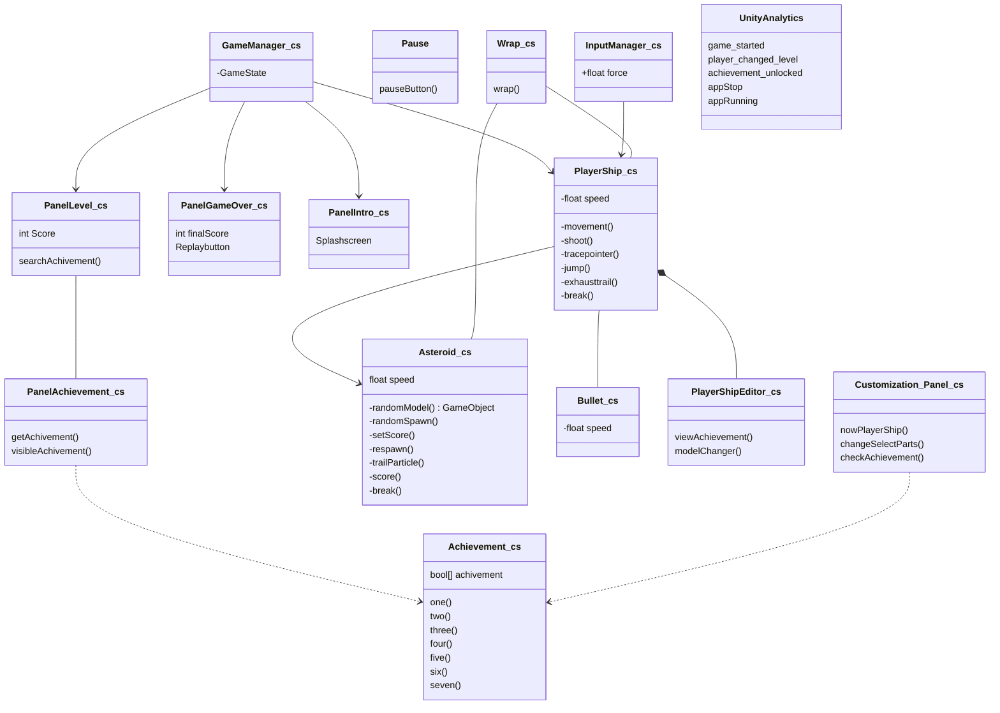

課題 1 - スクリプトの必要性
この種の読み物については、「課題と解決策について」を参照してください。
このシリーズのコース 1 と 2 では、アーケードの古典的な宇宙シューティングゲーム「アステロイド」を現代風にアレンジした「AsteraX」を開発します。
このシリーズの第 1 回と第 2 回では、アーケードの名作宇宙シューティングゲーム「Asteroids」を現代風にアレンジした「AsteraX」を開発します。もちろん、皆さんも同じようなゲームを開発したことがあるかもしれません。
このプロジェクトでは、Unity 認定プログラマ試験で出題されるコンセプトを具体的に盛り込みました。
今回のプロジェクトでは、Unity 認定プログラマ試験で出題されるコンセプトを盛り込みました。今回の講座とその後の講座で課題に取り組むことで
このコースとその後のコースで課題に取り組むことで、試験で出題されるほぼすべての概念に遭遇し、自信を持って試験に臨むことができるようになるでしょう。
自信を持って試験に臨むことができます。
シナリオ
すべてのゲーム開発はどこかで始める必要があり、それは多くの場合、次のようなものです。
ここでは、次の項目で提供する「要件定義書」を紹介します。
セッションリソースでダウンロードできます）。) このドキュメントには、コース 1 とコース 2 で実装しなければならないゲームのコア部分とすべての機能が記述されています。
このドキュメントには、このシリーズのコース 1 とコース 2 で実装する必要のある、ゲームの中核となる機能が記載されています。
これらの要件を参考に、プロジェクトのアーキテクチャを考えてみましょう。
クラスが必要で、それらはどのように連携するのでしょうか？
課題。
スクリプトコンポーネントと C#クラスのすべてをカバーする「コンポーネントとクラスのダイアグラム」（CCD）を作成してください。
課題：AsteraX の要件を Unity プロジェクトに実装するために必要なスクリプトコンポーネントと C#クラスをすべて網羅した「コンポーネントとクラスの図」（CCD）を描きます。
コードのマップは、これから始まるすべてのプログラミングタスクのガイドとして使用できます。この課題には、正確な
この課題（またはこのコースの他のプログラミング課題）に対する正確な正解はありません。
スクリプトの必要性をじっくりと考えてみてください。
ドキュメントの作成が終わったら、講師が一つの有効なソリューションを説明します。
あなたのソリューションには以下が含まれます。
スペースシップ、アステロイド、その他の GameObject が必要とする Unity コンポーネントのリスト。
必要なもの
スペースシップ、アステロイド、その他のゲームオブジェクトに必要な Unity コンポーネントのリスト ● 使用する、または作成する必要のあるクラスとメソッドの概要と図
作成
必要に応じて、ゲームオブジェクト間での情報の受け渡し方法の詳細
これは正式なものでなくても構いませんが、あなたが参考にしたり、あなたのアプローチを説明するのに使えるものにしてください。
正式なものでなくても構いませんが、参考にしたり、他のプログラマーに自分のアプローチを説明できるようなものにしておきましょう。
ゲームの実装には、Unity 2017.4 LTS を使用すると仮定します。
終わったら、自己評価のコースワークを完了してから、講師の解答に進みます。
インストラクターのソリューションに進みます。
ヒントとコツ
この課題を完成させるには様々な方法がありますので、非公式な例をご紹介します。
簡略化されたパックマンのようなゲームをベースにした非公式な例を用意しましたが、これはセッションリソースでもご覧いただけます。この
この例では、Requirements Doc と Components and Classes Diagram (CCD)の両方が含まれています。

# 要約

- AsteraX は認定プログラマ試験で出題されるコンセプトを盛りこんだリメイクゲー
- この文書にはコース 1、2 で実装する全機能が記載されてる、**CCD を考えてみる**

- 課題 - **スクリプトコンポーネント、C#クラスをすべて網羅した CCD を描く** - 明確な正解はない。必要性を考える
- 要件 - スペースシップ・アステロイド等の Unity コンポーネントリスト - 仕様・作成に必要なクラス・メソッドの概要と図 - ゲームオブジェクト間での情報の受け渡し方法の詳細 - 参考やアプローチ説明に使えるモノを作る

# Mermaid

