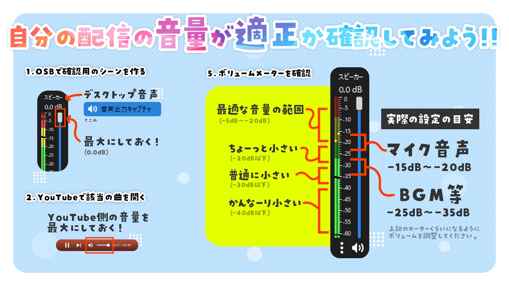

---
tags:
  - Bar
---

date:: [2024-07-08](Daily_Note/2024-07-08.md)
up::

## 自動文字起こし
動画を読み込む際に右に設定があるはずなので、ONにしておけばウィンドウ→テキスト→文字起こしで読める。

キャプションにはスタイルが設定可能。
スタイルはキャプション編集後、トラックスタイルの＋から追加できる。

[【PremierePro】キャプションで作成したテロップを一括で変更する方法【自動文字起こし】 | Sokoage Magazine](https://sokoage.com/magazine/pr_autotelopchange/)

キャプションのままだと座布団（背景）に諸々のエフェクトを掛けられない。
座布団にエフェクトを掛ける場合はタイムラインかエッセンシャルグラフィックスでキャプションを選択→グラフィックとタイトル→キャプションをグラフィックにアップグレード を選択。

[Premiere Pro でのキャプションの操作](https://helpx.adobe.com/jp/premiere-pro/using/working-with-captions.html)

再度文字起こしする場合はソースを右クリックして文字起こしすると動的文字起こしとなり語間削除が使える。

## エンコード
絶対に音声エフェクトを切り、Media Encodeに流してからエンコードする。
普通にやると音声がプチプチになったりして非常に面倒。

## ショトカ
wで選択したクリップをカット
shift + home & endで選択したクリップの前後へ移動

## 文字で四角形を決めるか
EGのテキスト設定、ポイントテキスト（文字依存）と段落テキスト（四角依存）

## 座布団
四角形とテキストを中心に配置し、四角形の追従にテキストをセット。
右でどこを揃えるか設定。
後はテキストを動かすとついてくる。

[テロップの座布団をPremiereProで自動調整する2つの方法 | TAKA流儀](https://taka-creative.com/telop-base-adjustment/)

## 音量調整
[x.com](https://x.com/kentax/status/1799371697486987755)
[x.com](https://x.com/tanukichimaru22/status/1821185410753851399)

```
-6〜-10：大きめ
-10〜-14：おすすめ
-14〜-18：小さめ
```


たぶん叫ぶこととか想定してマイクが小さめにされている


[Premiere Proで音量調整する方法3選【一部・自動・一括・ダッキング】](https://soho-biyori.com/premiere-pro-onryoutyousei)

よく言われるのは、合わせて使うBGMは-20dB

Premiereならエッセンシャルサウンドから自動音量調整が使える
また素材を右クリック→オーディオゲインで挿入時の音量を調整できる
さらにオーディオミキサーでトラックごとの音量を調整できる

## 自在マスク
単純な円マスクならシェイプ詳細についてるが、数値で位置を設定できない。（モザイクトラックとかに使う機能）

なのでシェイプ二つ重ねて片方シェイプでマスクを使用。ワイプ（放射状）を掛ければ扇形も作れる。
ワイプ（放射状）はワイプの中心を個別に設定しないとうまくかからないので注意。

