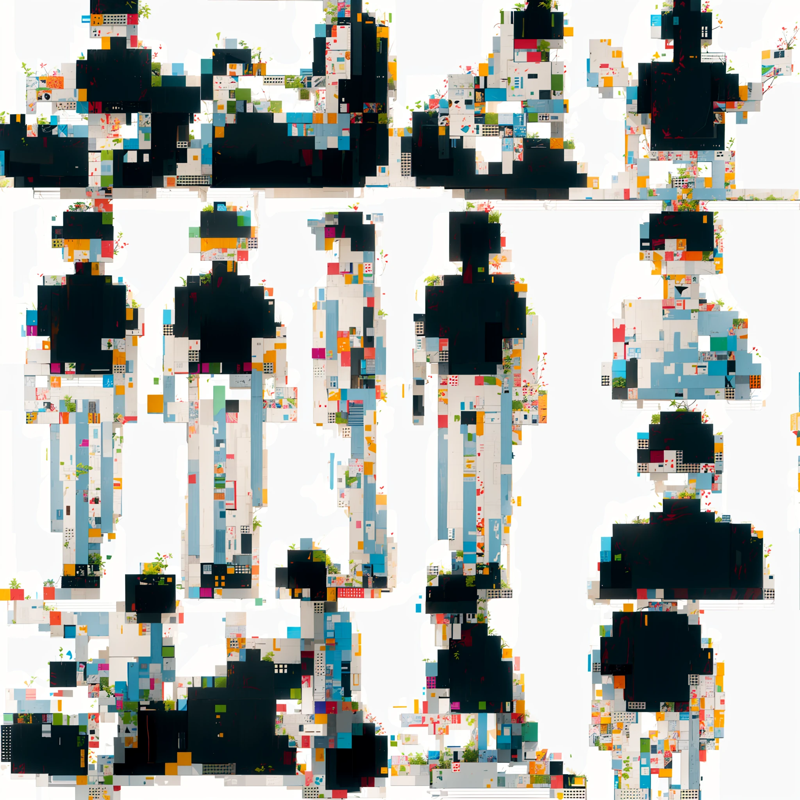

---
tags:
 - Bar
 - App
aliases:
 - AUTOMATIC1111
 - 1111
 - sdwebui
---

date:: [2023-05-07](/Daily_Note/2023-05-07.md)
up:: [Docker](Docker.md)
up:: [AI_image](../AI/AI_image.md)
same:: [ComfyUI](ComfyUI.md)
down:: [sdwebui docker](../../Info/sdwebui%20docker.md)
down:: [sdwebui plugin](../../Info/sdwebui%20plugin.md)
up:: [Stable Diffusion](../Stable%20Diffusion.md)

[AUTOMATIC1111/stable-diffusion-webui: Stable Diffusion web UI (github.com)](https://github.com/AUTOMATIC1111/stable-diffusion-webui)

もはや説明不要、名指しでcolabから弾かれるレベルで有名になった画像生成AIのUI。
名前が一般的過ぎるのでユーザー名のAUTOMATIC1111で呼ばれることもある。

プロンプトは前の奴のほうが優先されるらしい。
Ctrl+upの挙動を見る限り、数値指定しても位置による重みは反映されてるっぽい？

[【随時更新】NovelAI/Waifu Diffusionを使う際に有用なサイト・リンク集(備忘録) | 経済的生活日誌](https://economylife.net/links-for-novelai-waifu-diffusion/#gsc.tab=0)

推奨は**python3.10.11**。xformersがコンパイルできない。
comfyuiは3.10.6。

[sdwebui plugin](../../Info/sdwebui%20plugin.md)

[sd resolution](../../Info/sd%20resolution.md)

2024/06/06
知らない間にxformersでもodpでも起動できなくなっていた。
forgeしか使えない。

`--lowvram --xformers --no-half`でもつかない。
no-halfが無いとNaNになるのにno-halfつけるとRAM足りない。
--no-half-vaeでもNaN。

## マニアック機能

### Prompt Editing
[AUTOMATIC1111 の便利な機能](http://dskjal.com/deeplearning/automatic1111.html#diff-automatic)
http://dskjal.com/deeplearning/automatic1111.html#diff-automatic
[Stable Diffusion web UIを使ったAI画像生成のPromptの記法のまとめ｜mochineko](https://note.com/mochineko_/n/n4e1309693cce)

画像生成の途中でプロンプトを変更する。
これはプロンプトを混ぜられるということ。たとえば`a girl [wearing a onepiece:naked:10]`とかすると服が透けている表現になる。10ステップ目から切替。
小数にすると割合でステップを分ける。

数字を付けないと交互に適用する。Alternating Words。

### SPDA
よくわからんが`--xformers`の代わりに`--opt-sdp-attention`でより早くなるらしい。

[【14%高速化！】SPDAを使いxformersより高速に画像生成する方法を画像付き解説 | 経済的生活日誌](https://economylife.net/spda-pytorch2-cuda118-install/)

## forge
書き直して早くなった別バージョン。
gitで元のと一緒に使えるよとあるが問題が起きた時に困るのでmodelとかVAEとかLoRAだけシンボリックリンク振って分離するほうがよさそう。

[GitHub - lllyasviel/stable-diffusion-webui-forge](https://github.com/lllyasviel/stable-diffusion-webui-forge)

なんかメモリリークするらしいので、Dev2を使う。
EasySDXLWebUIを使うと元とモデルとか共有できて楽。

[GitHub - Zuntan03/EasySdxlWebUi: Animagine や Pony を Stable Diffusion web UI と forge で簡単に使えるようにします。](https://github.com/Zuntan03/EasySdxlWebUi)

## テク

### 順序
前にある単語ほど優先される。
(単語:float)とすれば、順序関係なく単語の強さを決められる。

### シード
シードが合ってれば、img2imgのvariation機能で大体同じ奴の画像を作れる。
惜しいけど方向性はあってる画像に使う。応用として、全年齢向けの画像を(ry

### R-18
[【R18】NovelAI(nsfw)の為のDanbooru語翻訳｜にきもなか](https://note.com/nkmonaka/n/n825aebad792c)

### 75トークン
75トークンを突破して入力する場合は、それより先をもう一度読み込むという処理になっている。
そのため76トークン目は強く影響するほか、消費vramが増えるので`--medvram`で対処。

### outpaint
新しく生成した絵の上から既存を重ね、一緒にノイズを拾っていくみたいな感じっぽい。
なのでプロンプトには追加で生成する部分の説明を多めに入れておく。

## 全体チュートリアル

[GitHub - Zuntan03/SdWebUiTutorial: 画像生成 AI ツールの Stable Diffusion web UI を、簡単に使えるようにする環境とチュートリアルです。](https://github.com/Zuntan03/SdWebUiTutorial)
[AIイラストが理解る！StableDiffusion超入門【2024年最新版】A1111、Forge対応｜賢木イオ @studiomasakaki](https://note.com/studiomasakaki/n/n7ad935416c5d)
[Waifu Diffusion で効率的に画像を生成する](https://dskjal.com/deeplearning/waifu-diffusion-workflow.html#batch)

[[../../Info/sd checkpoint]]

## soft inpainting
事前に用意した白黒マスクを元にふんわりインペインティングする機能。
白部分をinpaintとして描き直す。
周りが分からない画像とかをキャンバス広げとかで広げる→別にマスク出力した後これで補完、という形で全身画像を作れる。

[Stable Diffusion Stable Diffusion 見切れた部分の画像を生成する - img2img Inpainting によるOutpainting | iPentec](https://www.ipentec.com/document/stable-diffusion-outpaint-using-img2img-inpainting)

## 画像拡大
基本はExtrasかimg2imgからTile。
TileはSDXL非対応。3Dは最近対応したらしい。
TileとHyperTileは併用不可。

[lllyasviel/sd\_control\_collection · Tile Model for SDXL?](https://huggingface.co/lllyasviel/sd_control_collection/discussions/1)

[Upscaler - としあきdiffusion Wiki\*](https://wikiwiki.jp/sd_toshiaki/Upscaler)

## Clip Skip
層をスキップすることで、プロンプトを少し無視して反映させる。
モデルによっては推奨設定に入ってる。

[【Stable Diffusion】Clip Skipって何？設定方法と効果を解説  |  るんるんスケッチ](https://runrunsketch.net/sd_clipskip/)
-2はNAIがそうしてたかららしい。

## コンソールが落ちた時
フロントエンドが残されるが、これを次のコンソール起動時に使うのはお勧めしない。
落ちる前に保存されていた状態で起動するため、表記とずれが生じる可能性がある。
というかほぼ確定でズレるので大人しく再起動。

## ふんわり
Lineart(Realistic)を書けた後softedgeを入れると、FFの攻略本みたいになる。

## Prompt
Danbooru, e621などで集める。

[猿のたまり場](https://masturbation-monky.vercel.app)

## ckptフォルダ
--ckpt-dirで追加できる。""を追加する。
他のフォルダも追加できる。

## ガビタイル
nearest-latentアップスケールで4倍とか指定するとガビガビのバグったタイルみたいになる。

## AttributeError: 'NoneType' object has no attribute 'lowvram'
最初に読んだモデルが壊れてるとなる。
config.jsonで存在するモデルに直リンク。

[Fix corrupt model initial load loop by w-e-w · Pull Request #15600 · AUTOMATIC1111/stable-diffusion-webui · GitHub](https://github.com/AUTOMATIC1111/stable-diffusion-webui/pull/15600)

## FutureWarning: `resume_download` is deprecated and will be removed in version 1.0.0. Downloads always resume when possible.
Huggingface0.23.0のバグ。
`pip install huggingface<0.23.0`で回避できるが、そもそも出てても大して問題がある奴じゃないので無視でいい。

## 画像比較
[Imgsli](https://imgsli.com)

## 高速化
HyperとCFG1を使用する。
ネガティブ欲しいならNegPipに従い-1プロンプトを使用。

[複数キャラ画像の生成 · Zuntan03/EasySdxlWebUi Wiki](https://github.com/Zuntan03/EasySdxlWebUi/wiki/%E8%A4%87%E6%95%B0%E3%82%AD%E3%83%A3%E3%83%A9%E7%94%BB%E5%83%8F%E3%81%AE%E7%94%9F%E6%88%90)

## XLで生成画像がバグる奴
emhasis modeをnormに。

[よくある質問 - としあきdiffusion Wiki\*](https://wikiwiki.jp/sd_toshiaki/%E3%82%88%E3%81%8F%E3%81%82%E3%82%8B%E8%B3%AA%E5%95%8F#m6259a12)
[Stable Diffusion XLで生成画像の破綻が起きる問題の解析と対策｜hakomikan](https://note.com/hakomikan/n/nb6dd68a1bd9e)

## a1111で省VRAM

1. 公式のVAE(sdxl_vae.safetensors)はバグってるからsdxl.vae.safetensors(sdxl-vae-fp16-fix) を使用する  
2. 拡張機能のmultidiffusion-upscaler-for-automatic1111を入れてHires使用時はTiled VAEをオンにする（Encoder Tile Sizeはデフォ値or512 ※デフォ値以下のできるだけ大きい値で調整した方がいい）  
3. set COMMANDLINE_ARGS=--xformers --medvram-sdxl --opt-channelslast  
4. set PYTORCH_CUDA_ALLOC_CONF=garbage_collection_threshold:0.6, max_split_size_mb:128  
5. NVIDIAコンパネの3D設定で「CUDA - Sysmem Fall Back Policy」を「Prefer No Sysmem Fallback」にする  
  
16G民ならこれでだいたいいける  
1. 公式のVAE(sdxl_vae.safetensors)はバグってるからsdxl.vae.safetensors(sdxl-vae-fp16-fix) を使用する  
2. 拡張機能のmultidiffusion-upscaler-for-automatic1111を入れてHires使用時はTiled VAEをオンにする（Encoder Tile Sizeはデフォ値or1536 ※デフォ値以下のできるだけ大きい値で調整した方がいい）  
3. set COMMANDLINE_ARGS=--xformers  
4. NVIDIAコンパネの3D設定で「CUDA - Sysmem Fall Back Policy」を「Prefer No Sysmem Fallback」にする

[なんJ NovelAI部 406 (1/2) ふたばAIスレ難民発生/SDXL公式VAEバグ問題 : AI画像生成情報まとめ保管庫](https://ai-art.blog.jp/archives/28412474.html)
4:

Q.なんか久々にA1111使ったら生成クソ遅いぞ！このゴミカス！  
A.まずは旧Lycorisの拡張機能消せ。話はそれからだ。

[Stable Diffusion Web UIの設定を消費メモリを確認して行う｜みし](https://note.com/mith_mmk/n/n77e889f9f06d)

## KohyaHR

558:

ComfyでKohyaHRFixを二段で使ってるわ  
描き込み量が増えると絵柄も繊細なもんに変わるから好き

567:

KohyaHiresはマジで設定がわからん  
使いこなせると書き込みはHireFixより良くなるの？

  

607:

>>567  
>KohyaHiresはマジで設定がわからん  
>使いこなせると書き込みはHireFixより良くなるの？  
  
一辺の解像度が1500位までなら人体も崩れず、そのままポン出し出来てかなり実用的な機能やなって思う  
特に背景の方は2048位までなら違和感もなく生成も早いので便利かも  
[https://i.imgur.com/Z5BULav.png](https://i.imgur.com/Z5BULav.png)

697:

>>679  
横からだけど画素数の比のルート(1024×1024と2048×2048ならDownscaleは2.0)じゃね  
ただしlatentが64の倍数だかで処理されるはずだから、場合によってはwikiに書いてある基本解像度から外れたサイズで作るのと同じ状態になるかも

760:

>>697  
forgeやConfyのIntegratedと似た項目名で値逆なんよなA1111だと  
Integrated：Downscale Factor（倍率を入力する）：基本１以上　（自動でUpscalingも決めてくれる）  
A1111用：Downsampling scale（倍数を入力する）：基本1未満　※Upsamplingはその逆でDownsampling後の解像度から何倍にするか  
  
例：2048をポン出ししたい場合、グチャラないように最初1024から始めてSTOPのStepから2048にするので  
Integrated：Downscale Factor：2  
これをA1111用でやる場合は以下の通り  
Downsampling scale：0.5　＋　Upsampling scale：2.0  
  
SDXLの場合は出力したい解像度の長辺÷1024位が目安だと思われる

## アップローダー
■アップローダーについて  
「megaのパスが分からん」…「#」以下も含めたURL全体をコピペして飛べ  
[https://majinai.art/](https://majinai.art/)…出力した画像のプロンプトなどメタデータを掲載したいときに。エロNG。メタデータ付きのPNGのみ対応  
[https://imgur.com/](https://imgur.com/)…メタデータは削除される。自分が上げた画像を一覧したい（要ログイン）ときに。エロNG。webp非対応。スクリプト荒らしが使っていたためURLをNGにしているユーザーが一時期多かった  
[https://ul.h3z.jp/](https://ul.h3z.jp/)…エロOK。メタデータは削除される。管理人にとって不快な画像は消される  
[https://catbox.moe/](https://catbox.moe/)…メタデータ入りの画像を貼りたい、自分が上げた画像を一覧したい（要ログイン）ときに。エロや画像以外もOK。やや不安定で閲覧やログインできない時がある  
[https://imgbb.com/](https://imgbb.com/)…メタデータ入りの画像を貼りたい、自分が上げた画像を一覧したい（要ログイン）ときに。エロNG。画像のURLにはアップした画像のファイル名がそのまま使われるが、URL末尾のファイル名の部分は適当な文字列に変更してもかまわない  
※NAIの生成情報はPNGのメタデータだけでなくアルファチャンネルにも埋め込まれており、imgurやh3zに上げてもアルファチャンネルに埋め込まれた生成情報は残る。ちなRGBにもLSBステガノグラフィ署名がある  
■Animagine XL 3.1について [https://seesaawiki.jp/nai_ch/d/animagine31tips](https://seesaawiki.jp/nai_ch/d/animagine31tips)  
■ponyXL について [https://seesaawiki.jp/nai_ch/d/PonyDiffusionV6XLTips](https://seesaawiki.jp/nai_ch/d/PonyDiffusionV6XLTips)

[なんJ NovelAI部 407 (1/2) おしがま/ドルフィンショーツ : AI画像生成情報まとめ保管庫](https://ai-art.blog.jp/archives/28433165.html)

## RuntimeError: Cannot add middleware after an application has started

fastapiのバグ。0.90.1にダウングレードする。

[RuntimeError: Cannot add middleware after an application has started · AUTOMATIC1111/stable-diffusion-webui · Discussion #7749 · GitHub](https://github.com/AUTOMATIC1111/stable-diffusion-webui/discussions/7749)

## FreeU

187: 今、天王星のwiki見てきたら軌道傾斜角(i) が0.774°だった警備員[Lv.12][芽] (ﾜｯﾁｮｲ 8619-gYdo) sage 2024/07/02(火) 10:53:37.01 ID:nU1DZ5qF0 
FreeU使ってないけど使うのがメジャーなんか😳

194: 警備員[Lv.8] (ﾜｯﾁｮｲ 1a0e-Nx23) sage 2024/07/02(火) 11:28:11.68 ID:mDtV9gtL0 
>>187
**発色がよくなってシャープさが増す**
https://files.catbox.moe/k7qav8.jpg

他の人の絵に比べて色がくすんでボヤけてる気がする時はFreeUの有無のせいかもしれないNE

240: 今、天王星のwiki見てきたら軌道傾斜角(i) が0.774°だった警備員[Lv.7] (ﾜｯﾁｮｲ e335-B/Pm)  2024/07/02(火) 16:09:31.80 ID:nCKFHrxT0 
>>187
例の肌系光系プロンプト使ってるとFreeU有り無しでかなり違いを楽しめる
FreeU有り
https://files.catbox.moe/a9vpqx.png
FreeU無し
https://files.catbox.moe/kcwqup.png

## reforge
[GitHub - Panchovix/stable-diffusion-webui-reForge](https://github.com/Panchovix/stable-diffusion-webui-reForge/)

forgeのA1111追従版？