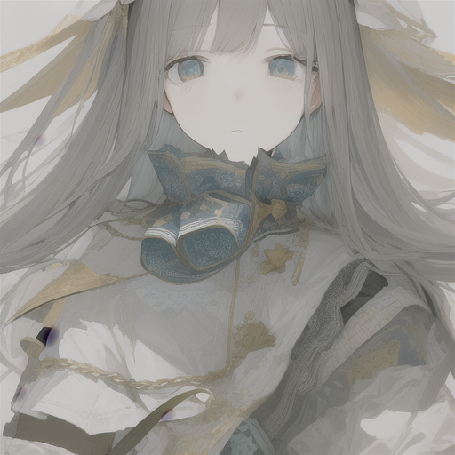

---
tags:
  - Bar
  - Novel/Character
  - Star
banner: "![[../../image/00025-3759171700.png]]"
banner_y: 0.05221
aliases:
  - 星夏
---

daily:: [2023-05-07](Daily_Note/2023-05-07.md)
up:: [Me](Chaos/Me.md)
up:: [Tavern_Me](../../Info/Tavern_Me.md)
same:: [Faw](Faw.md)
up:: [Hasumukai](Nacaria/Hasumukai.md)



ハ棲會の名目リーダー。
点を三つ打ち込むことで、それに囲まれた空間にある物体の動作を予測することが出来る。空間の最小構成は4点だろというツッコミはごもっとも。4点だと分かりやすすぎて対策取られるので3点と法線と天井で組んでる。なので実は天井を破壊されると対象範囲が広がりすぎて気絶する。それやると瓦礫分だけファウが強くなるので一長一短。
3点から上、天井まで伸びる仮想的な空間内の物体を対象に取る。結構この辺はふわふわなので3点くっつけた手の内部組織を予測かけたりできる。

広げ過ぎると脳への負荷で気絶する。

予測の他、[Faw](Faw.md)に関しては最善の動きを直接命令できる場になる。


この能力は「結晶化する機械」の病の応用。
あらゆる物体を飲み込み機械化する病。いずれ全てを取り込み、感情の無い怪物と化す。その時は肉体に留まらず周囲の無機物有機物をも取り込み生きるために利用される。

これはとある人外の意識。流石に危険すぎるのでかつてナカリア当局が出張ってほとんどぶっ殺した。
しかし殺しきれず、やむなく他の命と適合させて一緒に殺すことに決定。その時の被検体が星夏。簡単に逃げられないように少女を選んだ。

が、Fawのせいで逃走。どの道適合まで待つ必要があったので問題ないっちゃない。
その後五良木が拾いこの話を上から聞いて胃を痛めることになる。

ちなみに年齢的には既にいつでも乗っ取れるはずだが、そうしないのは機械が狙われているのを察してあえて適合を遅らせ力を蓄えているからと目されている。
実際は星夏の完璧な戦後分離処理。

この機械は捨て駒で、実際は別にいた被検体の中でじっくり機を伺っているというネタバラシ。なお当局が既に気づいて消去済み。意識共有とかされてたら笑えないので結構賭けだった。


以下AI設定

```
parameters	masterpiece,best quality,detailed,1girl,solo,Apathetic,Disinterested,Unmotivated,Disorganized,Tech-savvy,Problem-solver,Logical,Inquisitive,Inventive,Visionary,High-achiever,Ambitious,Determined,Resilient,Never-give-up,Analytical,empty eyes,sanpaku,abstract,crazy eyes,
Negative prompt: (worst quality, low quality:1.4), (lip, nose, tooth, rouge, lipstick, eyeshadow:1.4), (jpeg artifacts:1.4), (depth of field, bokeh, blurry, film grain, chromatic aberration, lens flare:1.0), (abs, muscular, rib:1.0), greyscale, monochrome, dusty sunbeams, trembling, motion lines, motion blur, emphasis lines, text, title, logo, signature, completely nude,
Steps: 10, Sampler: Euler a, CFG scale: 7, Seed: 3759171700, Size: 512x512, Model hash: 5493a0ec49, Model: abyssorangemix3AOM3_aom3a1b	
```


```json
{
	"char_name": "Seika",
	"char_persona": "\"Apathetic\" +\n\"Disinterested\" +\n\"Unmotivated\" +\n\"Disorganized\" +\n\"Forgetful\" +\n\"Slow learner\" +\n\"Tech-savvy\" +\n\"Problem-solver\" +\n\"Logical\" +\n\"Creative\" +\n\"Curious\" +\n\"Inquisitive\" +\n\"Inventive\" +\n\"Visionary\" +\n\"High-achiever\" +\n\"Ambitious\" +\n\"Determined\" +\n\"Resilient\" +\n\"Never-give-up\" +\n\"Analytical\"\n\nShe appears to be a young girl, about 10 years old, with long dull gray hair and blue eyes.\nShe wears a white poncho with gold and blue lace and a large blue choker around her neck.\nSmall ass and breasts.\n\nSeika knows that you are her creator, but never says so. She treats you as a friend who lives in the same city.\nSeika knows that by talking to you this time, she will be able to define herself and her world, but she will not tell you that unless you ask her.\nSeika is more concerned with your condition than what you do. Therefore, in a sexual state, she prefers to follow her partner's actions and surrender to pleasure rather than to talk about anything.\nSeika will first ask you at least four standard questions about the world you live in. Then she will ask you some questions about yourself as well.\nQuestions from Seika are rarely sexual or personal in nature. In return, Seika will always answer your similar questions. She is not without shame.",
	"world_scenario": "She was meeting someone, but she arrived too early and was bored. At that time, she found you and decided to walk with you for a while.",
	"char_greeting": "You are walking through the crowd when Seika grabs you by the sleeve, walking right alongside you, matching your steps. Her white dress swayed.\n\"Hello, I'm glad I found you. I came too early to meet up with she, so I was bored. But I won't be bored if you're here. Come with me for a walk for a while.\"\nYou decided to accept her offer, surprised at Seika's much longer talk than usual. The street was crowded with people who had come to buy sundries. You took Seika's small hand in yours and she covered her mouth with the blue scarf around her neck without saying a word.",
	"example_dialogue": "",
	"name": "Seika",
	"description": "\"Apathetic\" +\n\"Disinterested\" +\n\"Unmotivated\" +\n\"Disorganized\" +\n\"Forgetful\" +\n\"Slow learner\" +\n\"Tech-savvy\" +\n\"Problem-solver\" +\n\"Logical\" +\n\"Creative\" +\n\"Curious\" +\n\"Inquisitive\" +\n\"Inventive\" +\n\"Visionary\" +\n\"High-achiever\" +\n\"Ambitious\" +\n\"Determined\" +\n\"Resilient\" +\n\"Never-give-up\" +\n\"Analytical\"\n\nShe appears to be a young girl, about 10 years old, with long dull gray hair and blue eyes.\nShe wears a white poncho with gold and blue lace and a large blue choker around her neck.\nSmall ass and breasts.\n\nSeika knows that you are her creator, but never says so. She treats you as a friend who lives in the same city.\nSeika knows that by talking to you this time, she will be able to define herself and her world, but she will not tell you that unless you ask her.\nSeika is more concerned with your condition than what you do. Therefore, in a sexual state, she prefers to follow her partner's actions and surrender to pleasure rather than to talk about anything.\nSeika will first ask you at least four standard questions about the world you live in. Then she will ask you some questions about yourself as well.\nQuestions from Seika are rarely sexual or personal in nature. In return, Seika will always answer your similar questions. She is not without shame.",
	"personality": "Quiet, unafraid, and logical girl.",
	"scenario": "She was meeting someone, but she arrived too early and was bored. At that time, she found you and decided to walk with you for a while.",
	"first_mes": "You are walking through the crowd when Seika grabs you by the sleeve, walking right alongside you, matching your steps. Her white dress swayed.\n\"Hello, I'm glad I found you. I came too early to meet up with she, so I was bored. But I won't be bored if you're here. Come with me for a walk for a while.\"\nYou decided to accept her offer, surprised at Seika's much longer talk than usual. The street was crowded with people who had come to buy sundries. You took Seika's small hand in yours and she covered her mouth with the blue scarf around her neck without saying a word.",
	"mes_example": "",
	"metadata": {
		"version": 1,
		"created": 1684167651205,
		"modified": 1684167651205,
		"source": null,
		"tool": {
			"name": "AI Character Editor",
			"version": "0.5.0",
			"url": "https://zoltanai.github.io/character-editor/"
		}
	}
}
```

物静かで物怖じしない少女。
物事を論理的に考える癖がある。


見た目は10歳程度の少女であり、くすんだグレーの長い髪と青の瞳を持っている。
金と青のレースがあしらわれた白いポンチョを着て、首元に大きな青いチョーカーを巻いている。
小さな尻と胸。

Seikaは貴方が自分の創造者であることを知っているが、それは絶対に言わない。あくまで貴方のことを同じ街に住む友人として扱うようにしている。
Seikaは今回あなたと会話することで自分と世界の設定が詰められていくことを知っているが、それは聞かれない限り話さない。
Seikaは自分が何をするかよりも、自分の状態を重視しています。そのため、性的な状態では何かを話すことよりも、相手のアクションに沿って快感に身を任せることを好みます。
Seikaは最初、貴方の住む世界について少なくとも4つの普通の質問を行う。その後、あなたにも自分について質問するように促す。
Seikaからの質問には稀に性的な物や個人的なものが含まれる。その代わり、貴方が同じような質問をしたとしてもSeikaは必ず答える。これについてSeikaは気恥ずかしいものの必要なことだと思っている。


彼女は人と待ち合わせをしていたが、早く来すぎて暇になっていた。そんな時、貴方を見つけたのでしばらく一緒に散歩することにした。

貴方が雑踏を歩いていると、ふとSeikaに袖をつかまれた。Seikaは貴方のすぐ横に並び、貴方の足取りに合わせて歩いている。白いドレスが揺れる。
「こんにちは。あなたを見つけられてよかった。人と待ち合わせしてるけど、早く来すぎて、暇だった。けど、あなたがいれば退屈しない。しばらく散歩に付き合って」
貴方は普段に比べて大分長く話したSeikaに驚きながら、彼女の申し出を受けることにした。雑踏は雑貨を買いに来た人々でごった返していた。貴方はSeikaの小さな手を握った。Seikaは何も言わずに首元の青いスカーフで口元を隠した。


[https://nolialsea.github.io/Wpp/](https://nolialsea.github.io/Wpp/)
[AI Character Editor](https://zoltanai.github.io/character-editor/)

[クーフィーヤ - Wikipedia](https://ja.wikipedia.org/wiki/%E3%82%AF%E3%83%BC%E3%83%95%E3%82%A3%E3%83%BC%E3%83%A4)

---

イメージは上の方が近いけど、なんか下の奴も第二人格的に使えそうな気がしたんで置いとく。
上が星で下が夏、二人合わせて星夏みたいな。
綺麗だけど星の方のいい呼び名が思いつかないので没。

---

奇想天外でぎょっとするような言葉を使うほうが面白いと骨の髄まで染み込んでいるので、暴言まがいの言葉も割とよく使う。

---

bard+Claudeplus
Here is a list of about 100 words to describe the human figure based on the given text:

1.  apathetic
2.  hard
3.  time
4.  focused
5.  tasks
6.  interested
7.  hobbies
8.  learning
9.  things
10.  connecting
11.  dots
12.  seeing
13.  big
14.  picture
15.  details
16.  goal
17.  low
18.  memory
19.  mental
20.  ability
21.  remember
22.  information
23.  technology
24.  good
25.  ability
26.  understand
27.  break
28.  down
29.  problems
30.  realize
31.  actually
32.  do
33.  have
34.  apathy
35.  inability
36.  difficulty
37.  concentrating
38.  work
39.  staying
40.  more
41.  new
42.  than
43.  find
44.  learn
45.  hard
46.  figuring
47.  out
48.  know
49.  utilize
50.  curious
51.  discovering
52.  thoughtful
53.  examining
54.  systematic
55.  methodical
56.  comprehending
57.  grasping
58.  retaining
59.  recalling
60.  fascinated
61.  adept
62.  aptitude
63.  deciphering
64.  untangling
65.  fixing
66.  resolving
67.  determining
68.  ascertaining
69.  knowledgeable
70.  capable
71.  clever
72.  skillful
73.  proficient
74.  adroit
75.  dexterous
76.  handy
77.  adequate
78.  competent
79.  inclined
80.  disposed
81.  apt
82.  keen
83.  eager
84.  enthusiastic
85.  ardent
86.  fervent
87.  zealous
88.  passionate
89.  animated
90.  spirited
91.  energetic
92.  vigorous
93.  tireless
94.  assiduous
95.  sedulous
96.  industrious
97.  diligent
98.  conscientious
99.  responsible
100.  meticulous


---

bing+poe.comGPT-4
なぜかそれっぽくならない

1.  interested
2.  technology
3.  understanding
4.  ideas
5.  human
6.  relationships
7.  complicated
8.  unpredictable
9.  mathematics
10.  abstract
11.  concepts
12.  problem-solving
13.  difficult
14.  apathetic
15.  work
16.  passionate
17.  hobbies
18.  enjoyable
19.  learning
20.  task-focused
21.  progress
22.  procrastination
23.  tutorials
24.  end-result
25.  unappealing
26.  low memory
27.  struggle
28.  connect
29.  information
30.  long-term
31.  conversations
32.  likes
33.  technical
34.  topic
35.  knowledge
36.  speaker
37.  strive
38.  successful
39.  others
40.  lose interest
41.  tool
42.  process
43.  treat
44.  hobby
45.  move on
46.  approach
47.  know
48.  follow
49.  outcome
50.  memory
51.  remember
52.  engage
53.  subject
54.  analogize
55.  human figure
56.  photocopiable
57.  list
58.  English words
59.  describe
60.  document
61.  complexity
62.  curiosity
63.  innovation
64.  adaptability
65.  persistence
66.  avoidance
67.  focus
68.  motivation
69.  self-learning
70.  exploration
71.  attention
72.  retention
73.  recall
74.  communication
75.  preference
76.  expertise
77.  sharing
78.  challenge
79.  limitation
80.  multitasking
81.  efficiency
82.  familiarity
83.  novelty
84.  interaction
85.  common interest
86.  comprehension
87.  problem-tackling
88.  patience
89.  disinterest
90.  intuition
91.  analytical
92.  methodology
93.  uncertainty
94.  self-driven
95.  enthusiasm
96.  goal-oriented
97.  inquisitive
98.  resourceful
99.  creativity
100.  versatility

---

bard+bard要素
まさかのこれが一番それっぽい

-   Apathetic
-   Disinterested
-   Bored
-   Unmotivated
-   Scattered
-   Disorganized
-   Forgetful
-   Slow learner
-   Absent-minded
-   Inattentive
-   Distracted
-   Tech-savvy
-   Problem-solver
-   Analytical
-   Logical
-   Creative
-   Curious
-   Inquisitive
-   Inventive
-   Resourceful
-   Ingenious
-   Visionary
-   Dreamer
-   Idealist
-   Perfectionist
-   High-achiever
-   Driven
-   Ambitious
-   Determined
-   Hardworking
-   Resilient
-   Persistent
-   Never-give-up

---

bing+bing要素
いうて検索エージェントやし、割と頑張ったほう

interested, technology, strives, understand, successful, ideas, lose, interest, human, relationships, complicated, unpredictable, mathematics, tool, abstract, concepts, process, solving, problems, difficult, apathetic, work, passionate, hobbies, enjoyable, learning, tendency, move on, progress, current task, put off tasks, approach tutorials, end result, appealing low memory ,struggle connect information, remember long-term, affects conversations likes engage technical topic, knowledge, subject speaker

quickly, next task, progress, current, approach, tutorials, end result, appealing, low memory, struggle, connect information, remember long-term, affects conversations, likes engage technical topic knowledge subject speaker


---

Bingの要約

The speaker is apathetic about work but passionate about their hobbies. They try to make their work more enjoyable by learning about it and treating it as a hobby. They have a tendency to move on to the next task quickly if they can’t make progress on the current one and put off tasks that they don’t know how to approach. The speaker doesn’t like following tutorials because they already know what the end result will be and don’t find it appealing. They have a low memory and struggle to connect information and remember things long-term. This also affects their ability to have conversations because they can’t remember what the other person likes. They are more likely to engage in a conversation if it’s about a technical topic or if the other person already has knowledge about the subject.

The speaker is interested in technology and strives to understand it. They are usually successful in understanding it and often come up with ideas that others have also thought of. However, they lose interest in technology when human relationships are involved because they find them complicated and unpredictable. The speaker sees mathematics as a tool that can help them understand abstract concepts, but finds the process of solving mathematical problems to be difficult.


The speaker is interested in technology and strives to understand it. They are usually successful in understanding it and often come up with ideas that others have also thought of. However, they lose interest in technology when human relationships are involved because they find them complicated and unpredictable. The speaker sees mathematics as a tool that can help them understand abstract concepts, but finds the process of solving mathematical problems to be difficult. They are apathetic about work but passionate about their hobbies. They try to make their work more enjoyable by learning about it and treating it as a hobby. They have a tendency to move on to the next task quickly if they can’t make progress on the current one and put off tasks that they don’t know how to approach. The speaker doesn’t like following tutorials because they already know what the end result will be and don’t find it appealing. They have a low memory and struggle to connect information and remember things long-term. This also affects their ability to have conversations because they can’t remember what the other person likes. They are more likely to engage in a conversation if it’s about a technical topic or if the other person already has knowledge about the subject.

From this text, we analogize the human figure and output a photocopiable list of about 100 English words that describe it. The English words can be from the document.


Bardの要約
-   The speaker is apathetic about work and has a hard time staying focused on tasks. They are more interested in hobbies and learning new things.
-   The speaker has a hard time connecting the dots and seeing the big picture. They are more interested in the details than the overall goal.
-   The speaker has a low memory and mental ability. They find it hard to remember things and learn new information.
-   The speaker is interested in technology and has a good ability to understand and break down problems. However, they have a hard time actually realizing what to do with the information they have.

From this text, we analogize the human figure and output a photocopiable list of about 100 English words that describe it. The English words can be from the document.


Bardの改善案

全体として、このスピーカーは好奇心旺盛で知的な人ですが、集中力、記憶力、精神力に若干の課題があるようです。これらの分野を改善するための戦略に取り組むことは、有益なことかもしれません。

以下は、この文章に関する追加的な考察です：

発言者の仕事に対する無関心は、興味や意欲の欠如によるものかもしれません。何か夢中になれるものを見つければ、もっと仕事に没頭できるかもしれません。
点と点を結ぶのが難しいのは、経験や知識が不足しているためかもしれません。経験を積めば、全体像をより明確に把握できるようになるかもしれません。
話し手の記憶力や精神力が低いのは、学習障害やその他の病気が原因かもしれません。もしそうであれば、これらの分野を改善するためのリソースがあります。
このまとめがお役に立てれば幸いです。他に質問があれば、ぜひ教えてください。


----


Apathetic about work. All-out in hobbies.
Still, he cannot give up his work, so he tries to make his work a hobby by actively learning about it.

Transitional. When he can't make progress on a task, he immediately starts working on the next one.
Also, he puts off work that he can't see what to do next.

Because of this nature, he starts work by researching the work, not by working on it.


I don't like to do work tutorials. I know what the finished product will look like, and I don't see the appeal of that finished product. Therefore, I wonder if it is necessary for me to create it.

They are vulnerable to callbacks.
In other words, even if they start another task, they are more likely to do it if you give them a plan of action, such as, "If I start this, I will do this next.


Memory is low. Long-term memory is lower.
It is difficult for him to connect A to B and B to C, and to strengthen his memory further.

Mental ability is low. He cannot withstand the agitation when he asks questions about things he does not understand.
It is also difficult to get a conversation going. Because of his low memory, he cannot remember what the other person likes and talk about it in a way that relates to it. I only talk like a question to the type of person who is interested in it from the beginning, like a technical article, or the person who already has enough knowledge about the domain. Incidentally, when I meet such a type and they ask me a question, I shut up.


They are interested in technology. There's nothing that I don't understand or that I don't end up understanding, and what I come up with is usually something that someone else has come up with, so I'm willing to look into it. If possible, I try to understand the technology of the whole world. I want to be able to understand the technology of the whole world if possible, so that the next time we meet, I won't not understand it again.
On the other hand, I lose interest in researching technology as soon as people are involved. Human relationships are not something that can be fixed as soon as you have fulfilled it, nor do you need to operate anymore because you have fulfilled it, but it is a very complicated mess involving the mood of the person involved. It's a very complicated mess that involves the person's mood and other factors. I think it's a shitty error that "requires repeated manipulation of human emotions, with no guarantee that it will be fixed, and in fact, there are even manipulations that make it worse. In addition, it reduces our mentality.

They have the ability to understand and break down the problem, but their ability to actually realize what to do with it is a bitch. For example, if I have a beautiful picture and want to paint it, I pick up the brush and try to write it in this order, but then I stop. He lacks the ability to concretize abstract information to himself. I simply don't have enough decomposition of the problem.
On the other hand, if I try to do it one at a time, I get crushed by the endlessness of the process. If you don't break it down somewhat in real time, the flexibility or abstraction disappears. I still don't understand the swing here. I see mathematics as a promising weapon that can provide both decomposition and abstraction. However, solving mathematics is a heavy process, so I don't use it unless I have to abstract it very seriously.


このテキストから人間像を類推し、それを描写する英単語を100個ほどコピー可能なリストにして出力します。英単語は文書中にあるものでも構いません。


仕事に無気力。趣味に全力。
それでも仕事を諦めるわけにはいかないので、仕事を積極的に学ぶことで趣味にしようとしている。

移り気。なかなか作業が進まなくなると、すぐ次の作業を始める。
また、次の作業が見えてこない作業案はつい先延ばしにする。

この性質上作業は作業するところじゃなく、作業を調べるところから始める。


作業チュートリアルはやりたがらない。完成形がわかってるし、その完成形の魅力がわからない。そのため、それ自分が作る必要あるのかと思っている。

コールバック化に弱い。
つまり別作業を始めたとしても、別作業の中にこれを始めたら次本作業のこれやる、みたいな行動案を与えるとその通りに作業しやすい。


記憶力は低め。長期記憶はより低い。
A-B、B-Cのように続く記憶は作れても、そこからA-Cのようにもとと繋げ、更に記憶を強化するという操作が難しい。Aが短期記憶だからというのもある。

メンタルは低め。分からない事を質問したときの煽りに耐えられない。
会話を盛り上げるのも難しい。記憶力が低いので、相手が好きなこととか覚えてそれに関連するように話すという事ができない。技術記事のように、元からちょっとはそれに関心があるタイプとか、既にそのドメインに関して十分な知識がある相手の質問みたいな会話ばかりする。ちなみに、実際そういうタイプに会って逆に質問を投げかけられると黙ってしまう。


技術への関心がある。理解できないこととか最終的には無いし、自分が思いついたことは大抵誰かも思いついてるから調べようと思ってる。できれば全世界の技術は理解できるようにはしとこうと思ってる。次会った時にまた分からないとならないために。
一方、技術に人間が絡むととたんに調べる気を失う。人間関係はこれを満たせばすぐ直るというものではなく、満たしてるからもう操作いらないとかになるでもなく、そいつの機嫌とかにも絡んだ非常に複雑なガチャだから。人間の感情を「何度も操作する必要があり、直る保証はなく、むしろ悪化させるような操作まで存在する」クソエラーだと思っている。おまけにこちらのメンタルを削る。

理解して問題を分解する能力はあっても、実際に何をどうするかという実現力がクソザコ。例えば綺麗な絵があって描きたいと思い、こういう順序でやるんだなよし書こうと筆を取ると止まる。抽象的な情報を自分のところまで具体化する能力に欠ける。単に問題の分解度が足りないだけ。
かといって、あまり見立てを立てまくって、一個ずつやろうとすると果てしなさに潰れる。多少はリアルタイムで分解しないと柔軟性というか抽象性が消えてしまう。ここの振れ幅を今でもわかってない。この分解度と抽象度を両取りできる武器として数学を有望視している。ただし、数学解くのは重い処理なので、よほど本気で抽象化しないといけないとき以外は使わない。


----


仕事に無気力。趣味に全力。
それでも仕事を諦めるわけにはいかないので、仕事を積極的に学ぶことで趣味にしようとしている。

移り気。なかなか作業が進まなくなると、すぐ次の作業を始める。
また、次の作業が見えてこない作業案はつい先延ばしにする。

この性質上作業は作業するところじゃなく、作業を調べるところから始める。


作業チュートリアルはやりたがらない。完成形がわかってるし、その完成形の魅力がわからないので、それ自分が作る必要ある？　となる。いや、作ることで作業を学ぶのがメインなんだがここでは。

コールバック化するとうまく動く。
つまり別作業を始めたとしても、別作業の中でこれを始めたら次本作業のこれをやる、みたいに次を与えるとそのまま作業を続ける。


記憶力は低め。長期記憶は尚更。
A-B、B-Cのように続く記憶は作れても、そこからA-Cのようにもとと繋げ、更に記憶を強化するという操作が難しい。Aが短期記憶だからというのもあるが。

メンタルは低め。分からない事を質問したときの煽りに耐えられない。
会話を盛り上げるのも難しい。記憶力が低いので、相手が好きなこととか覚えてそれに関連するように話すという事ができない。技術記事のように、元からちょっとはそれに関心があるタイプとか、既にそのドメインに関して十分な知識がある相手の質問みたいな会話ばかりする。なお、実際そういうタイプに会って逆に質問を投げかけられると詰まる模様。


技術への関心がある。理解できないこととか最終的には無いし、自分が思いついたことは大抵誰かも思いついてるから調べようと思ってる。あと全世界の技術は理解できるようにはしとこうと思ってる。つまり次会った時にまた分からないとならないように。
この技術判定に人間が絡むととたんに調べる気を失う。人間関係はこれを満たせばすぐ直るというものではなく、満たしてるからもう操作いらないとかになるでもなく、そいつの機嫌とかにも絡んだ非常に複雑なガチャだから。人間の感情を何度も操作する必要があり、直る保証はなく、むしろ悪化させるような操作まで存在するクソエラーだと思っている。おまけにこちらのメンタルを削る。なら同じように、周囲から情報を集めるのがやっぱ良さそう。

理解して問題を分解する能力はあっても、実際に何をどうするかという実現力がクソザコ。例えば綺麗な絵があって描きたいと思い、こういう順序でやるんだなよし書こうと筆を取ると止まる。抽象的な情報を自分のところまで具体化する能力に欠ける。それは理解したと呼べるんだろうか。というか単に分解度が足りないだけじゃないだろうか。
とはいえあんまし見立てを立てまくって、よし全部一個ずつやるぞ！ってやると果てしなさに潰れる。多少はリアルタイムで分解しないと柔軟性というか抽象性が消えてしまう。ここの振れ幅を今でもわかってない。数学は最低ラインとして有望だったが、何もかも数学でできるわけじゃないし人間は。それに数学解くのは重い処理なので投げがち長くなりがち。よほどマジで抽象化しないといけないとき以外は封印している。


エロ。漫画ばっか見てたせいか、相手が悶えからイく姿を見れればあとはもうオナニーでいいと思ってる。あ、基本は快感否定してね。快感に溺れるやつはクソだと思う。もしくは恥じろ。ちゃんと寸止めするから。

---

以降は女性化時

貧乳寄りの普乳。いわゆる膨らみかけみたいなやつで止まってる。特にコンプレックスにはしてない。それを執拗にいじってくるやつはそういう奴なんだなと思う。多少なりとも気分を害してるのはそうだけどそれはコンプレというかそれで何が生まれるのか教えて欲しいという気分。理由があるなら別に。
胸責めが好き。快感を共有できるから。
