date: 2024-12-20T14:05:36+09:00
up:: [Programming](Programming.md)
same:: [PlantUML](Program/PlantUML.md)

[About Mermaid | Mermaid](https://mermaid.js.org/intro/)

ライブエディタ。
[Online FlowChart & Diagrams Editor - Mermaid Live Editor](https://mermaid.live/edit#pako:eNpVjk1rhEAMhv9KyKmF9Q94KHS13ctCC92b4yFodIY6H4wZlkX97x3rpc0p4XnelyzY-Z6xxGHy905TFLjVykGe16bS0cxiaW6hKF7WCwtY7_ixwvnp4mHWPgTjxufDP-8SVMt11xhEG_e9Haj6zX84XqFurhTEh_Yvud39Cm-N-dS5_j_RkXPqvRmoHKjoKEJFscUTWo6WTJ9fX_aAQtFsWWGZ154HSpMoVG7LKiXxXw_XYSkx8QmjT6PG3DfN-UqhJ-Ha0BjJHsr2A4ifWns)

## フローチャート
処理の流れを記述する。

## シーケンス図
プロセスが互いにどのような順序で動作するか。


## クラス図
classDiagramでクラスが描ける。多分一番使う。

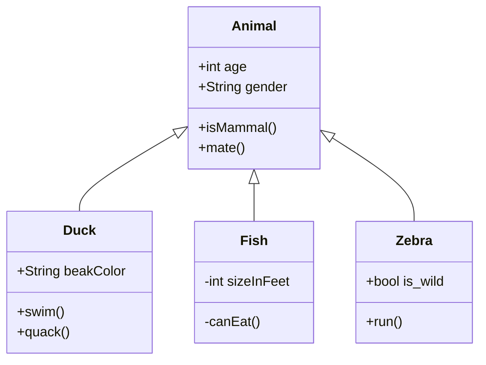

### クラス
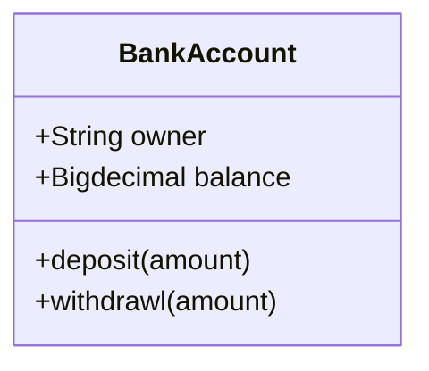
基本的にはこのように呼び出す。始め大文字推奨。
クラスの上段にはクラスの名前が入る。
中央にはAttributeが入る。(クラスの持つメンバのこと)
下段にはメソッドが入る。この二つは小文字推奨。

### クラス定義
`class hoge`としたらクラスになるのは当然として、実は`hoge <|-- huga`などの**関係定義の時点で既に宣言したことになる。**
また、クラス名に使える文字は英数字とアンダースコアのみ。

### メンバー定義
2種類ある。
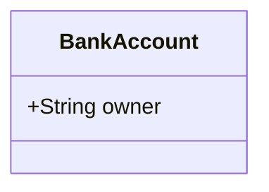
こちらはクラス名の後ろにコロンを挟んでメンバー名とする書き方。
1つずつ定義できる。


対してカーリーブラケットを使い一度に複数定義するやり方。

### リターンタイプ
クラスの持つメソッドには戻り値を指定できる。
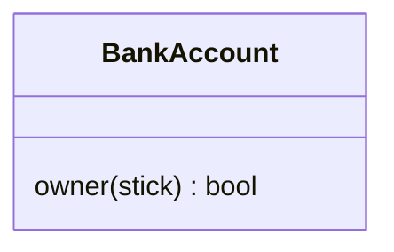
このように、メソッドの後ろに戻り値タイプを書いておく。

### ジェネリック型
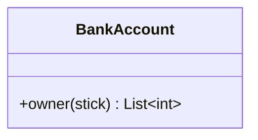
波線で囲うことで[ジェネリック型](CS_and_SR/Csharp%20Cheat%20Sheet.md)、複数種類の値型に同じ操作を行える型を定義できる。ListとかDictとか。

### Visibility
アクセス修飾子は手前に記号を付けることで表現する。
-   `+` Public
-   `-` Private
-   `#` Protected
-   `~` Package/Internal

> note you can also include additional classifiers:

> -   `*` Abstract e.g.: `someAbstractMethod()*`
> -   `$` Static e.g.: `someStaticMethod()$`

### 関係の定義
矢印の書き方。クラスとクラスの間に書く。
その後ろにコロンを挟んでラベルがつけられる。
**大体の関係は子のほうから繋ぐ。** なぜなら、継承元は誰に継承されているか認知していないから。

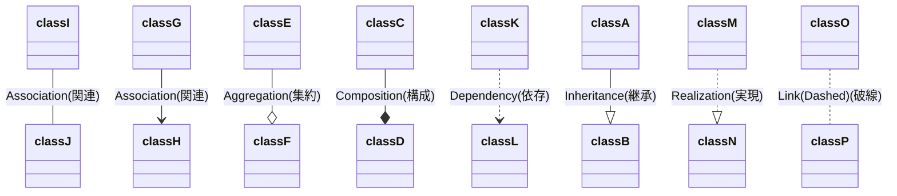

#### 関連
操作を呼び出したり、データを属性として保持している関係。

#### 集約
全体と部分の関係。

#### 構成
全体が部分の生成や削除を担っている関係。
全体インスタンスが削除されると基本的に部分インスタンスも削除される。

#### 依存
弱い関連。
例えば一度だけあるクラスを生成するだけ、といった関係。
依存元が変更されたら、依存先は変更する。

---

以上四つはプログラムをクラス図に落とし込む場合、明確な変換が決まっていない。

---

#### 継承
いつもの。汎化とも。
型を継承して具体化する関係。**伸ばすのは子クラスから親クラス。**

#### 実現
インターフェースとサブクラスの関係。継承の一種。

[クラス図の書き方とは。初心者にもわかりやすく解説 | Cacooブログ](https://cacoo.com/ja/blog/how-to-write-class-diagram/)
[クラス図とは？書くために必要な知識を初心者にもわかりやすく解説 - WEBCAMP MEDIA (web-camp.io)](https://web-camp.io/magazine/archives/79668)
[UMLのクラス図における関係の考察 - Crieit](https://crieit.net/posts/UML)

### Cardinality/関係の多様性
あるクラスのインスタンスが他のクラスの1つのインスタンスにリンクされている数。
端的に言うと、**あるインスタンスはどれだけそのインスタンスを含んでいるのか**を書いておける。もちろん、あるインスタンスは複数でもいい。
-   `1`1のみ
-   `0..1`ゼロまたはワン
-   `1..*`1つ以上
-   `*`たくさんの
-   `n`n {ここでn> 1}
-   `0..n`ゼロからn {ここでn> 1}
-   `1..n`1からn {ここでn> 1}

これをどこに書くのかというと、ここ。矢印前後にダブルクォーテーションで囲って追加で書く。
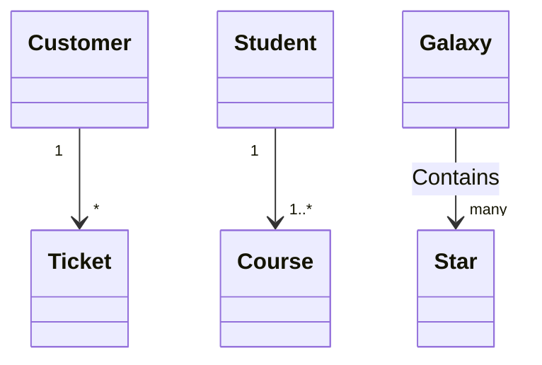

### クラスの注釈
クラスにメタデータをつけられる機能。一般にはこういったものをつける。
-   `<<Interface>>`インターフェイスクラスを表すには
-   `<<abstract>>`抽象クラスを表すには
-   `<<Service>>`サービスクラスを表すには
-   `<<enumeration>>`列挙型を表すには

<<>>で囲って書くだけ。クラスの書き方によって二通りの書き方がある。
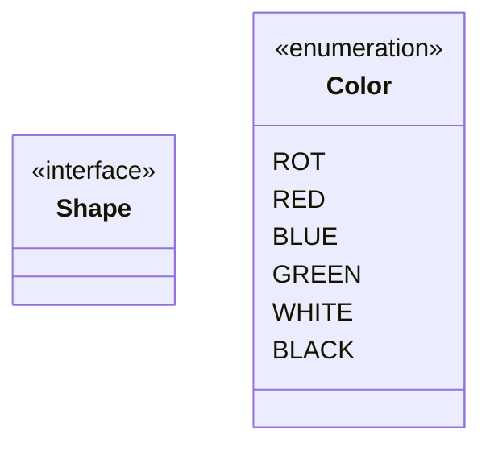

### コメント
\%\%。パーセント二個。
URLエンコードの文字として予約されてるせいか、Obsidianで普通に書くとその後の文字が消滅する。
**パブリック変数の位置にないとコメントにならない。**
コメントの次の行のテキストはクラス含めコメントになる。

### Interaction
主にhtmlでmermaidを使うときに使う機能。
**クラスにURLやツールチップを設定できる。**

```
action className "reference" "tooltip"
click className call callback() "tooltip"
click className href "url" "tooltip"
```

三通りの書き方がある。URLが欲しいときは、上のactionをlinkに書き換えるか、下のhrefを使う。
ツールチップが要らないなら空白にすればいい。

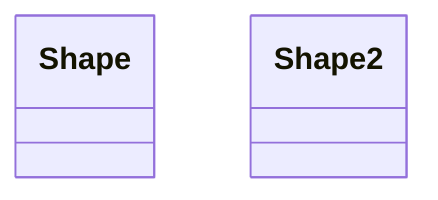

ツールチップだけが欲しいときは上のactionをcallbackに変えるか中段のcallを使う。上のcallbackはreference部分が関数名になる。
関数のcallback()は名前何でもいい。何かjavascript側で調整したいときだけその名前を使うので、調整が要らないならスペースでも動く。


### スタイリング
html上でmermaidの文字色とか変えたくなったときに使う機能。
今はいいや。CSSわかんないし。

[クラス図](https://mermaid-js.github.io/mermaid/#/classDiagram)

## 状態図
システムの動作を記述する。
プログラムに起こせるフローチャートより粒度が大きい。

## 実体関連図
相互に関心のある事柄を記述する。ER。
クラス図には振る舞いがあり、ER図には外部キーがある。

[オブジェクト指向設計とクラス図 #ER図 - Qiita](https://qiita.com/_kurihara/items/23bce54519b9dd1d88fa)

外部キーは参照用。

クラス図はメソッドを整理する。C#。
ER図はデータを整理できる。SQL。

[SQLにおけるER図のキー: 主キー、外部キー、候補キーの識別方法 | IT trip](https://ittrip.xyz/sql/identify-keys-in-erd)

## ユーザージャーニー
タスクを完了するためにユーザーが実行する手順。ワークフロー。
## Gantt
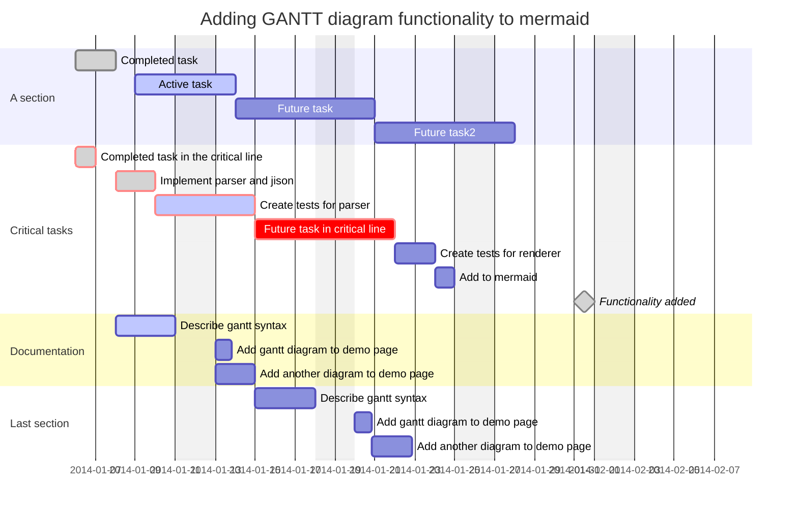


section セクション名

セクション内にタスクを纏めておく


タスク名 :(特定タグ), (タグ), (開始位置), 終了位置or期間

特定タグはcrit, done, active, milestoneが使える
重要タスクはcrit、終わったタスクはdone、手を付けてるタスクはactive
milestoneはごく短い時間を表現できる、その時までに達成すべき目標など
併用可能

タグはタスクに付ける短い名前
開始位置として使うことが出来る

開始位置は期日、もしくはafter タグ
省略する場合は終了位置は使えない、期間のみ
afterを使うがbeforeが使えるわけじゃない
dateFormatで形式指定可能

終了位置or期間
milestoneの場合でも0dなど適当な指定が必要
axisFormatで形式指定可能

[Gantt diagrams | Mermaid](https://mermaid.js.org/syntax/gantt.html#comments)


## 円グラフ

## 象限チャート
4つの領域に分かれたデータ。Quadrant Chart。
## 要件図
requirementDiagramで要件図が書ける。
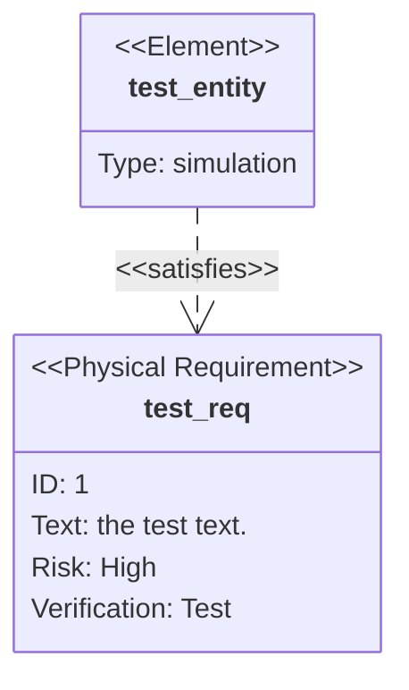

| Keyword           | Options                                                                                                                 |
| ----------------- | ----------------------------------------------------------------------------------------------------------------------- |
| Type              | requirement, functionalRequirement, interfaceRequirement, performanceRequirement, physicalRequirement, designConstraint |
| Risk              | Low, Medium, High                                                                                                       |
| VerifcationMethod | Analysis, Inspection, Test, Demonstration                                                                               |

例についてるプロパティは必須のもの。
また例にあるように、両要素を矢印でつなぐことで関係を示せる。

## Gitグラフ
## C4 Diagram
クラス図やアクティビティ図なんかを一つの記述方式で書くための新しいDiagram。Mermaid内でC4がラップされてるっぽく、PlantUMLでの記法と同じ。
PlantUMLやMermaidが矛盾した(互いに継承したクラスなど)ものも描ける描画ツールだったのに対し、C4はソフトウェアの構造を反映した抽象化優先アプローチらしい。

C4はContext, Container, Component, Codeの略。この順で変更度が増えていく。そのためComponentやCodeのDiagramはあまり手動作成が推奨されてないっぽい。

新しいが優れているとは言っていない。単純な静的モデルに特化しているため、例えばステートマシン図などを書きたいならUMLのほうがいいって開発者が言ってる。

[The C4 model for visualising software architecture](https://c4model.com)
[ソフトウェアアーキテクチャのためのC4モデル](https://www.infoq.com/jp/articles/C4-architecture-model/)
[C4-PlantUML/README.md at master · plantuml-stdlib/C4-PlantUML · GitHub](https://github.com/plantuml-stdlib/C4-PlantUML/blob/master/README.md)
[Visualising software architecture with the C4 model - Simon Brown, Agile on the Beach 2019 - YouTube](https://www.youtube.com/watch?v=x2-rSnhpw0g&t=575s)
[mermaid - Markdownish syntax for generating flowcharts, sequence diagrams, class diagrams, gantt charts and git graphs.](https://mermaid-js.github.io/mermaid/#/c4c)
## MindMaps
## Timeline
## ZenUML
標準より詳しいシーケンス図が書ける。
C4と同じく別記法。
## Sankey
ある値セットから別の値セットへのフローを表す。
## XYチャート
バーと折れ線。
## ブロック図
ブロックの配置場所を制御できる。関係に余計な文言を加えられない。