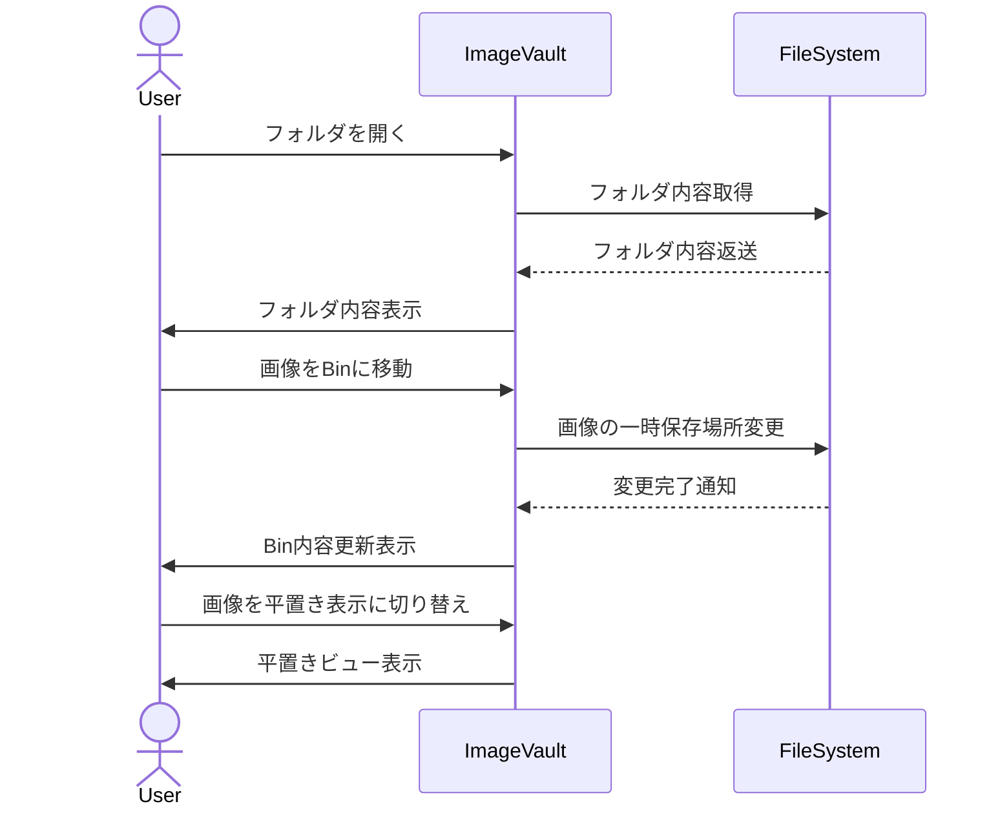
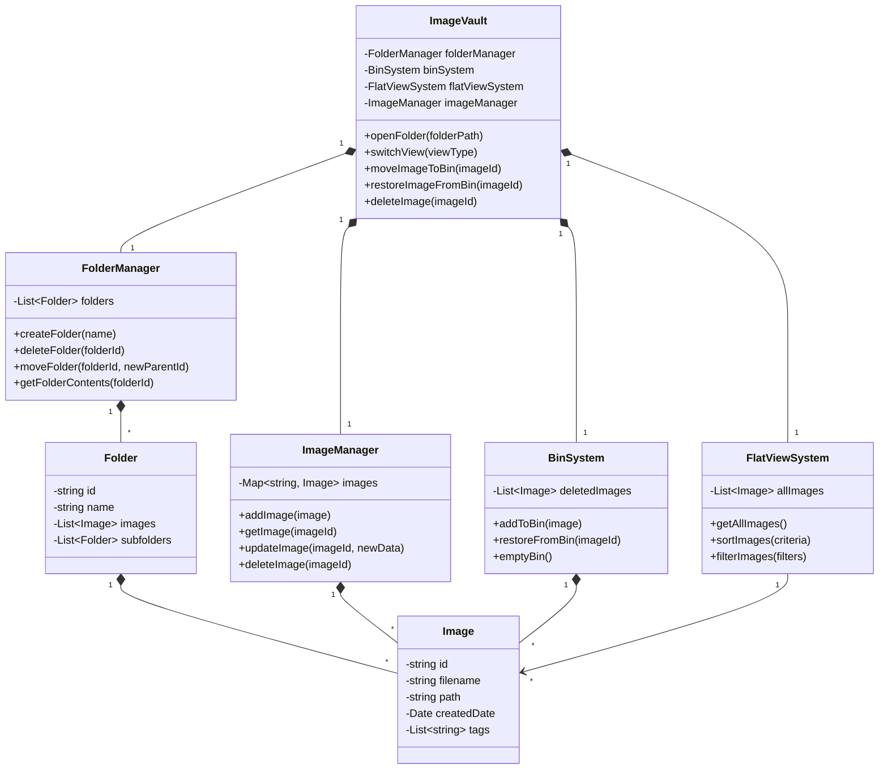

ImageVault

```mermaid
sequenceDiagram
    actor User
    participant ImageVault
    participant FileSystem

    User->>ImageVault: フォルダを開く
    ImageVault->>FileSystem: フォルダ内容取得
    FileSystem-->>ImageVault: フォルダ内容返送
    ImageVault->>User: フォルダ内容表示
    User->>ImageVault: 画像をBinに移動
    ImageVault->>FileSystem: 画像の一時保存場所変更
    FileSystem-->>ImageVault: 変更完了通知
    ImageVault->>User: Bin内容更新表示
    User->>ImageVault: 画像を平置き表示に切り替え
    ImageVault->>User: 平置きビュー表示
```

```mermaid
classDiagram
    class ImageVault {
        -FolderManager folderManager
        -BinSystem binSystem
        -FlatViewSystem flatViewSystem
        -ImageManager imageManager
        +openFolder(folderPath)
        +switchView(viewType)
        +moveImageToBin(imageId)
        +restoreImageFromBin(imageId)
        +deleteImage(imageId)
    }

    class FolderManager {
        -List~Folder~ folders
        +createFolder(name)
        +deleteFolder(folderId)
        +moveFolder(folderId, newParentId)
        +getFolderContents(folderId)
    }

    class Folder {
        -string id
        -string name
        -List~Image~ images
        -List~Folder~ subfolders
    }

    class BinSystem {
        -List~Image~ deletedImages
        +addToBin(image)
        +restoreFromBin(imageId)
        +emptyBin()
    }

    class FlatViewSystem {
        -List~Image~ allImages
        +getAllImages()
        +sortImages(criteria)
        +filterImages(filters)
    }

    class ImageManager {
        -Map~string, Image~ images
        +addImage(image)
        +getImage(imageId)
        +updateImage(imageId, newData)
        +deleteImage(imageId)
    }

    class Image {
        -string id
        -string filename
        -string path
        -Date createdDate
        -List~string~ tags
    }

    ImageVault "1" *-- "1" FolderManager
    ImageVault "1" *-- "1" BinSystem
    ImageVault "1" *-- "1" FlatViewSystem
    ImageVault "1" *-- "1" ImageManager
    FolderManager "1" *-- "*" Folder
    Folder "1" *-- "*" Image
    ImageManager "1" *-- "*" Image
    BinSystem "1" *-- "*" Image
    FlatViewSystem "1" --> "*" Image
```
