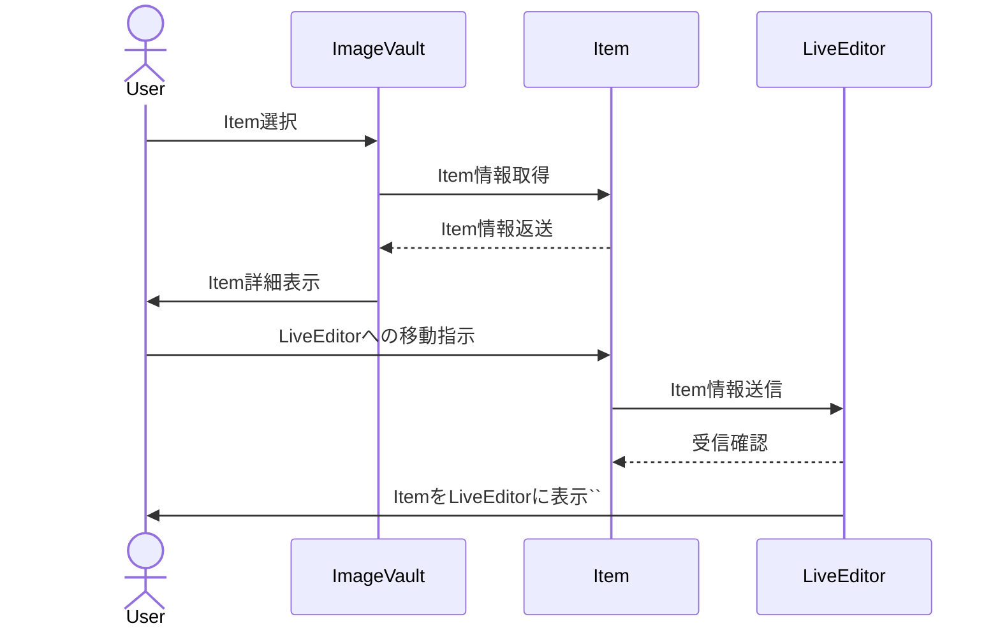
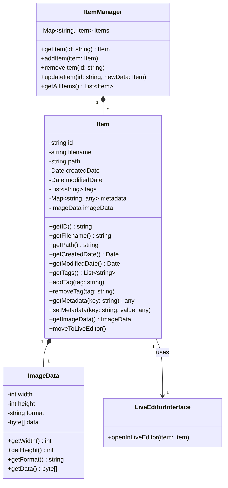

Item

```mermaid
sequenceDiagram
    actor User
    participant ImageVault
    participant Item
    participant LiveEditor

    User->>ImageVault: Item選択
    ImageVault->>Item: Item情報取得
    Item-->>ImageVault: Item情報返送
    ImageVault->>User: Item詳細表示
    User->>Item: LiveEditorへの移動指示
    Item->>LiveEditor: Item情報送信
    LiveEditor-->>Item: 受信確認
    LiveEditor->>User: ItemをLiveEditorに表示``


```

```mermaid
classDiagram
    class Item {
        -string id
        -string filename
        -string path
        -Date createdDate
        -Date modifiedDate
        -List~string~ tags
        -Map~string, any~ metadata
        -ImageData imageData
        +getID() string
        +getFilename() string
        +getPath() string
        +getCreatedDate() Date
        +getModifiedDate() Date
        +getTags() List~string~
        +addTag(tag: string)
        +removeTag(tag: string)
        +getMetadata(key: string) any
        +setMetadata(key: string, value: any)
        +getImageData() ImageData
        +moveToLiveEditor()
    }

    class ImageData {
        -int width
        -int height
        -string format
        -byte[] data
        +getWidth() int
        +getHeight() int
        +getFormat() string
        +getData() byte[]
    }

    class ItemManager {
        -Map~string, Item~ items
        +getItem(id: string) Item
        +addItem(item: Item)
        +removeItem(id: string)
        +updateItem(id: string, newData: Item)
        +getAllItems() List~Item~
    }

    class LiveEditorInterface {
        +openInLiveEditor(item: Item)
    }

    Item "1" *-- "1" ImageData
    ItemManager "1" *-- "*" Item
    Item "1" --> "1" LiveEditorInterface : uses
```
