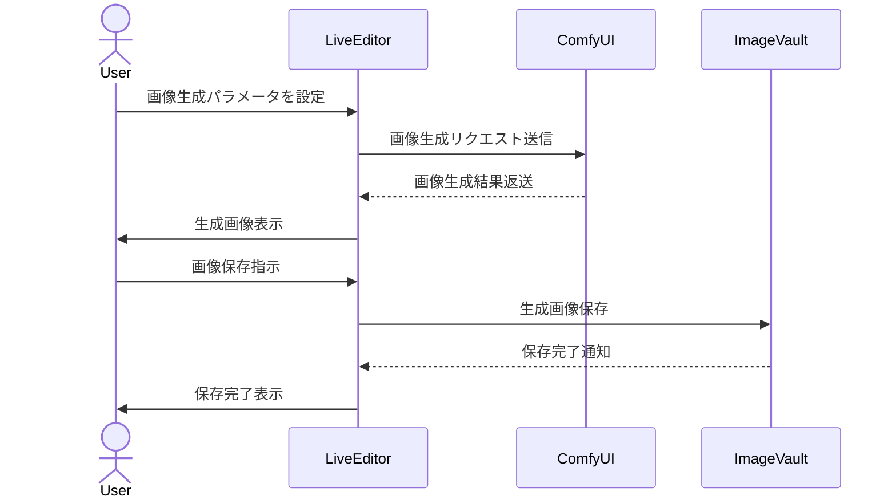
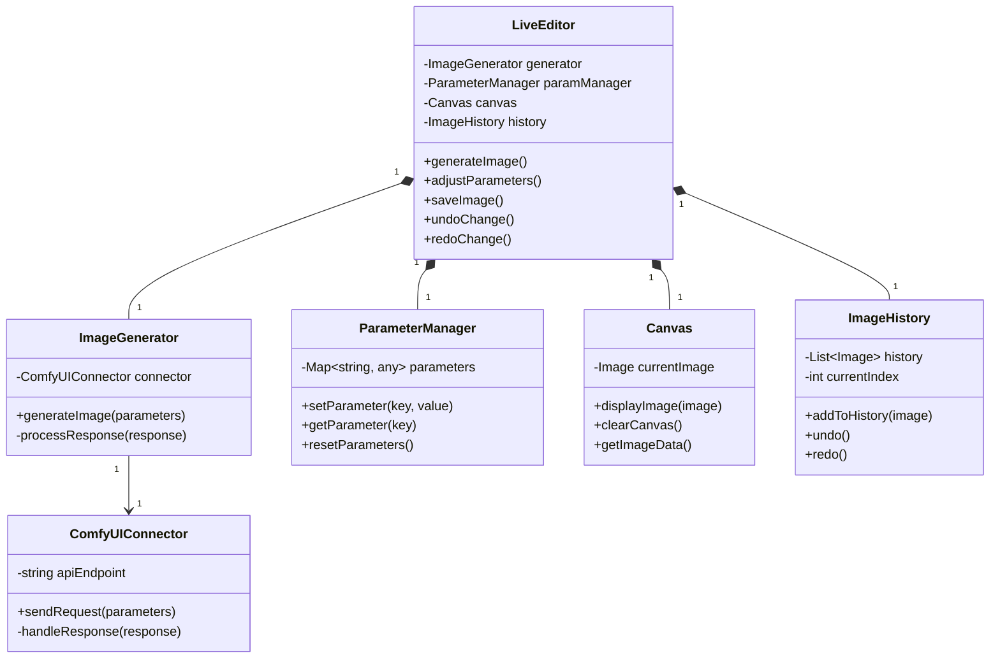

daily:: [2024-08-12](/Daily_Note/2024-08-12.md)
up:: [Daicer](../Novels/programs/Daicer.md)

LiveEditor

```mermaid

sequenceDiagram
    actor User
    participant LiveEditor
    participant ComfyUI
    participant ImageVault

    User->>LiveEditor: 画像生成パラメータを設定
    LiveEditor->>ComfyUI: 画像生成リクエスト送信
    ComfyUI-->>LiveEditor: 画像生成結果返送
    LiveEditor->>User: 生成画像表示
    User->>LiveEditor: 画像保存指示
    LiveEditor->>ImageVault: 生成画像保存
    ImageVault-->>LiveEditor: 保存完了通知
    LiveEditor->>User: 保存完了表示
```

```mermaid
classDiagram
    class LiveEditor {
        -ImageGenerator generator
        -ParameterManager paramManager
        -Canvas canvas
        -ImageHistory history
        +generateImage()
        +adjustParameters()
        +saveImage()
        +undoChange()
        +redoChange()
    }

    class ImageGenerator {
        -ComfyUIConnector connector
        +generateImage(parameters)
        -processResponse(response)
    }

    class ParameterManager {
        -Map~string, any~ parameters
        +setParameter(key, value)
        +getParameter(key)
        +resetParameters()
    }

    class Canvas {
        -Image currentImage
        +displayImage(image)
        +clearCanvas()
        +getImageData()
    }

    class ImageHistory {
        -List~Image~ history
        -int currentIndex
        +addToHistory(image)
        +undo()
        +redo()
    }

    class ComfyUIConnector {
        -string apiEndpoint
        +sendRequest(parameters)
        -handleResponse(response)
    }

    LiveEditor "1" *-- "1" ImageGenerator
    LiveEditor "1" *-- "1" ParameterManager
    LiveEditor "1" *-- "1" Canvas
    LiveEditor "1" *-- "1" ImageHistory
    ImageGenerator "1" --> "1" ComfyUIConnector
```
