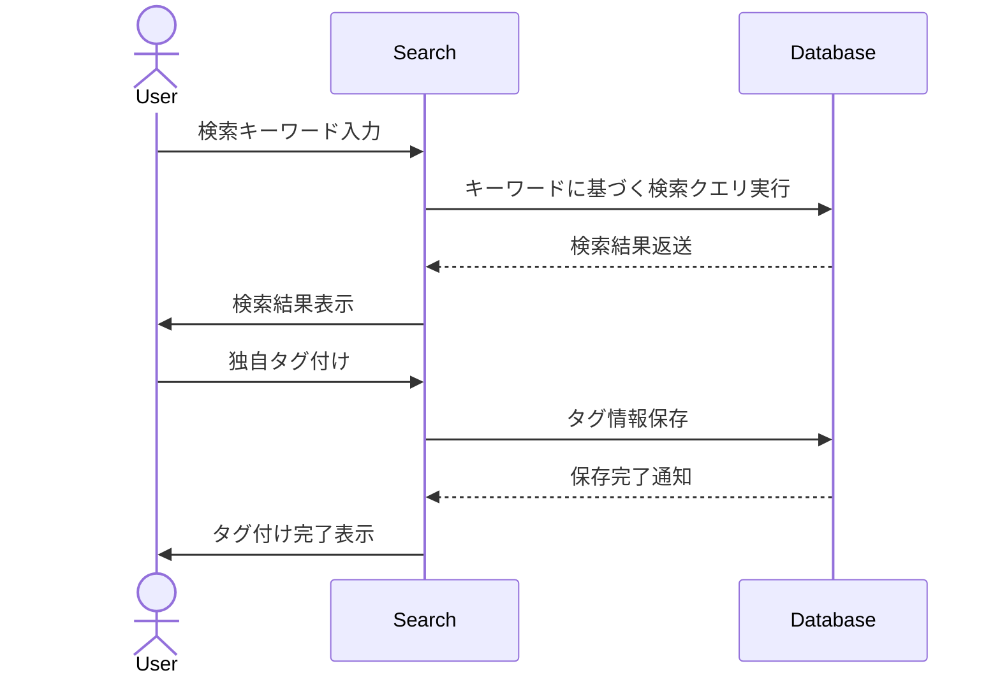
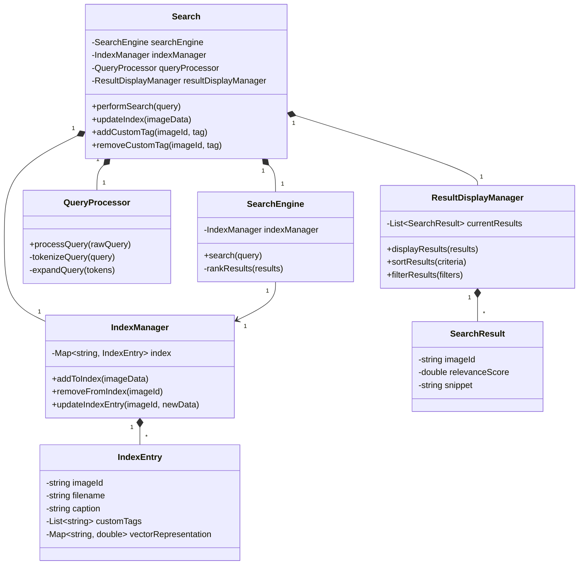

Search

```mermaid
sequenceDiagram
    actor User
    participant Search
    participant Database

    User->>Search: 検索キーワード入力
    Search->>Database: キーワードに基づく検索クエリ実行
    Database-->>Search: 検索結果返送
    Search->>User: 検索結果表示
    User->>Search: 独自タグ付け
    Search->>Database: タグ情報保存
    Database-->>Search: 保存完了通知
    Search->>User: タグ付け完了表示
```

```mermaid
classDiagram
    class Search {
        -SearchEngine searchEngine
        -IndexManager indexManager
        -QueryProcessor queryProcessor
        -ResultDisplayManager resultDisplayManager
        +performSearch(query)
        +updateIndex(imageData)
        +addCustomTag(imageId, tag)
        +removeCustomTag(imageId, tag)
    }

    class SearchEngine {
        -IndexManager indexManager
        +search(query)
        -rankResults(results)
    }

    class IndexManager {
        -Map~string, IndexEntry~ index
        +addToIndex(imageData)
        +removeFromIndex(imageId)
        +updateIndexEntry(imageId, newData)
    }

    class IndexEntry {
        -string imageId
        -string filename
        -string caption
        -List~string~ customTags
        -Map~string, double~ vectorRepresentation
    }

    class QueryProcessor {
        +processQuery(rawQuery)
        -tokenizeQuery(query)
        -expandQuery(tokens)
    }

    class ResultDisplayManager {
        -List~SearchResult~ currentResults
        +displayResults(results)
        +sortResults(criteria)
        +filterResults(filters)
    }

    class SearchResult {
        -string imageId
        -double relevanceScore
        -string snippet
    }

    Search "1" *-- "1" SearchEngine
    Search "1" *-- "1" IndexManager
    Search "1" *-- "1" QueryProcessor
    Search "1" *-- "1" ResultDisplayManager
    SearchEngine "1" --> "1" IndexManager
    IndexManager "1" *-- "*" IndexEntry
    ResultDisplayManager "1" *-- "*" SearchResult
```
