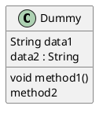
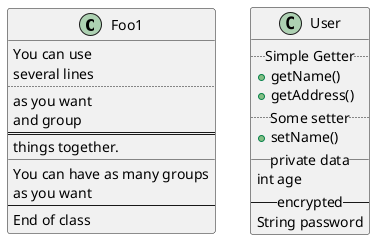
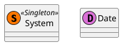
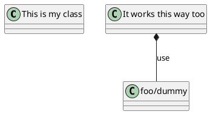
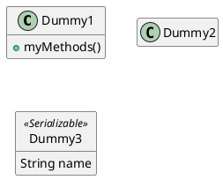
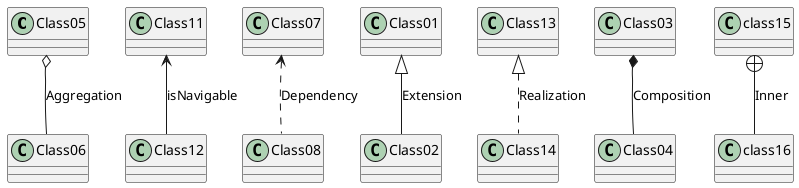
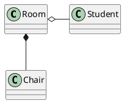
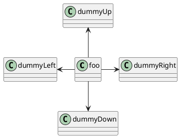
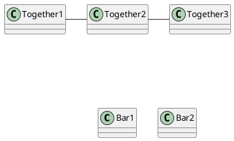

---
tags:
 - Info
---

date:: [2022-11-25](/Daily_Note/2022-11-25.md)
up:: [PlantUML](../Bar/Program/PlantUML.md)

## 基本

フィールドとメソッドを並べて書ける。
{}を使うとフィールドを強制したり出来る。ちなみにstaticとabstractはこれをしないと宣言できない。static = classifier。

## 高等なクラス

セパレータを使い独自に区分けできる。

## 宣言できるもの
class, interface, enum, abstract, entity, anotation.

### 特殊目印

定義されてないものに目印をつけたいなら、こう。

### anotation
実行時にいろんな注意を付記するもの。
Java用。

@Overrideならインターフェイスメソッドのオーバーライドメソッドを示す。

@Deprecatedなら名前変更したせいでもう使われてないメソッドを示す。

@SuppressWarningsなら様々な状況で警告を出さないようにできる。

この他独自でアノテーションを作る方法もあるらしい。

source:: [【Java入門】アノテーションの使い方と作成する方法 \| 侍エンジニアブログ](https://www.sejuku.net/blog/22694)

### abstract
abstractでもabstract classでも宣言可能。

## 非文字

asを使うことで変数のように宣言できる。

## クラスの非表示、削除

showとhideで細かい非表示設定ができる。
消したいときは代わりにRemove。

基本は`hide empty members`。

クラスも非表示できる。

### 孤立クラスの非表示・削除

hide @unlinked、
remove @unlinked。

## 関係

重ねて文字を書いてる部分を一つにすると横向きになる。

隙間にrightやleftを挟んで自由に変えることもできる。

### Aggregation
集約。
### isNavigable
誘導可能性。Association、関連とも。
### Dependency
依存。

### 集約、誘導可能性、依存の使い分け
- 集約は全体クラスと部分クラス。学校と生徒。
- 誘導可能性は集約ほど強くなく、オブジェクトにアクセスしてメソッドを使用する可能性があるくらいの認識。部活と生徒。
- 依存はそのオブジェクトを引数として使用するくらいの弱い関係。**一方のクラス内でメンバとして宣言しない。** 学校と部活。

source:: [【クラス図の矢印】集約、誘導可能性、依存の違い](https://www.sugurusato.com/programming/java/class3diff/)

### Extension
継承。Inheritanceや汎化といった名称も。
`class name extends classname`でも書ける。
### Realization
実現。
インターフェース用。
`class name implements interfacename`でも書ける。まあ見ての通りJava文法だけど。
### Composition
構成。
インスタンスの生成や削除を担う。
### Inner
内部クラス。

source:: [PlantUML使い方メモ - Qiita](https://qiita.com/opengl-8080/items/98c510b8ca060bdd2ea3)
source:: [クラス図の構文と機能](https://plantuml.com/ja/class-diagram#c08f8d9927fcb626)

## レイアウト

togetherを使えば、ある程度クラスをグループ化できる。扱い的には同じパッケージにある感じ。

## カラーとスタイル
線の間に\[\]で色々つけて線スタイルを変えたり色を変えたりできる。
インラインスタイルで書けばクラスの色を変更することもできる。

### skinparams
もっと詳しく変更したいときに。

実際に使うのは`skinparam shadowing false`や`skinparam monochrome true`、`skinparam monochrome reverse`じゃなかろうか。

source:: [Changing colors and fonts](https://plantuml.com/ja/skinparam)

## その他
注釈機能や、生成画像の分割、矢印まとめ機能なんかがある。