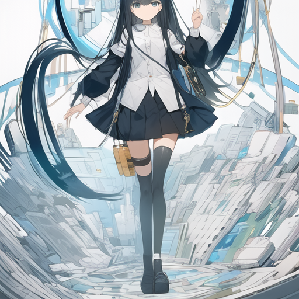
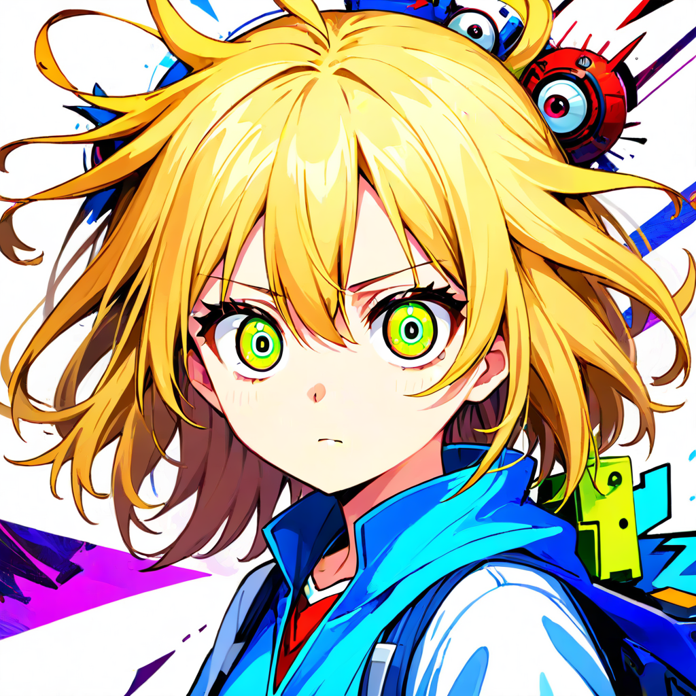
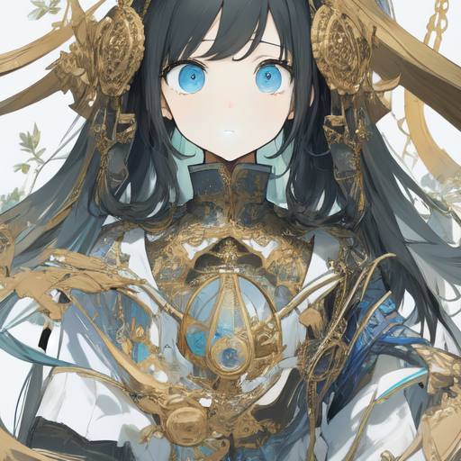
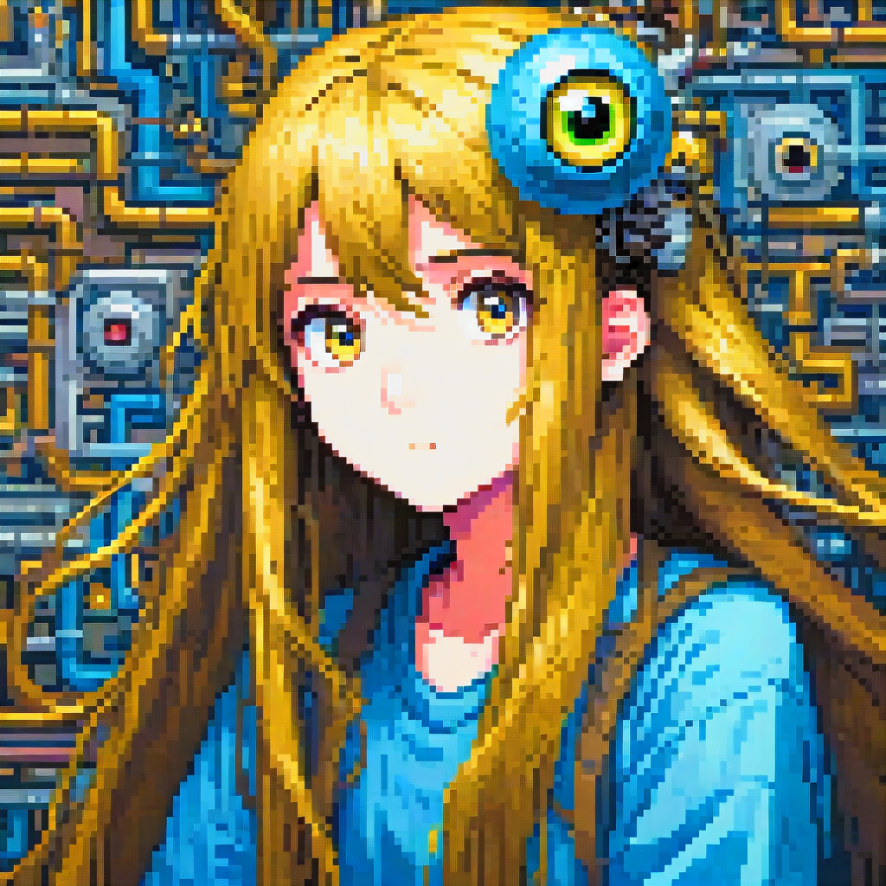
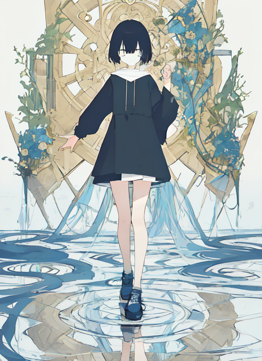
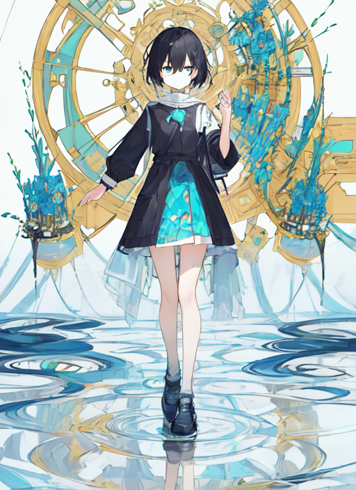
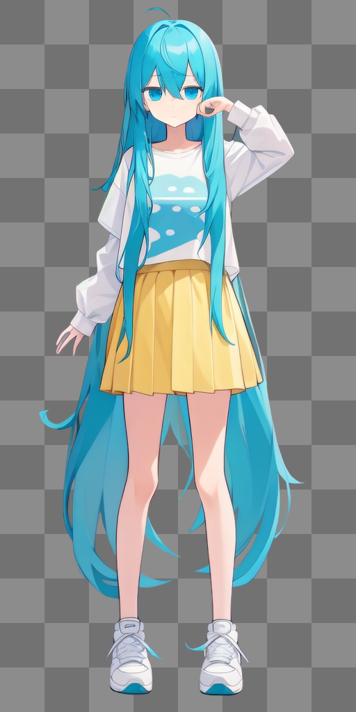

---
tags:
  - Info
---

date:: [2024-03-14](/Daily_Note/2024-03-14.md)
up:: [Stable Diffusion](../Bar/Stable%20Diffusion.md)

## 規約
CreativeML Open RAIL-Mライセンスが一般的。
Civit.aiだと加筆されて使われてる場合があるので要注意。

[CreativeML Open RAIL-M ライセンスをわかりやすく意訳](https://zenn.dev/hases0110/articles/7cff43c5baed7d)
[【注意喚起】使用モデルのライセンスを再確認しよう！｜スタジオ真榊【AIイラスト術解説】｜pixivFANBOX](https://studiomasakaki.fanbox.cc/posts/5364772)

また、dreamlikeと付いたものは**後から改変できる**ので注意。

禁止事項はCivit.aiの物を書く。
以下の事項から書いてる奴だけ転記。

- Use the model without crediting the creator
    
- Sell images they generate
    
- Run on services that generate images for money
    
- Run on Civitai
    
- Share merges using this model
    
- Sell this model or merges using this model
    
- Have different permissions when sharing merges

## abyssorangemix3AOM3_aom3a1b
[AbyssOrangeMix3 (AOM3) - AOM3A1B | Stable Diffusion Checkpoint | Civitai](https://civitai.com/models/9942/abyssorangemix3-aom3)
[WarriorMama777/OrangeMixs · Hugging Face](https://huggingface.co/WarriorMama777/OrangeMixs)

SD1.5。
幻想的かつ緻密な絵を得意とする。
油絵風。

モデルバリエーションにより様々なライセンスが付属する。
一応AOM3A1だけが商用利用禁止でAOM3A1Bは商用可能のOpen RAIL-Mなのだが、CivitaiだとAOM3で一律禁止されてる。
問題を完全回避したいならAOM2や1を使う。~~そもそも1.5系はNAIリークが大抵入ってるから元から問題という説もある。~~
これもNAI入り。
ちなみにHugging Faceの方だとAOM3B4などマイチェン版がいくつかある。

NAIリークについて損害賠償などを請求できるのは流出より3年以内らしい。
[【画像生成AI】Stable Diffusion派生モデルを利用・公開するときはライセンスに注意しましょう｜はせ@AI Photo](https://note.com/hases0110/n/n69b8a5784750)

### 禁止事項
いつものCreativeML Open RAIL-Mに、色々制約が足されるAddendumという形式。

- Use the model without crediting the creator
  modelはクレジット無しで使用不可
- Sell images they generate
  作った画像は売れない
- Run on services that generate images for money
  生成サービスを売れない
- Run on Civitai
  Civitaiで動かせない
- Sell this model or merges using this model
  モデルやマージモデルを売れない
- Have different permissions when sharing merges
  マージモデルは同じライセンスを持つ

…のはずなのだが、マージモデルがsellthisくらいしか継承してなかったりする。
謎のライセンス混乱。

### 推奨NP
```
nsfw, (worst quality, low quality:1.4), (lip, nose, tooth, rouge, lipstick, eyeshadow:1.4), (blush:1.2), (jpeg artifacts:1.4), (depth of field, bokeh, blurry, film grain, chromatic aberration, lens flare:1.0), (1boy, abs, muscular, rib:1.0), greyscale, monochrome, dusty sunbeams, trembling, motion lines, motion blur, emphasis lines, text, title, logo, signature,
```

## animagineXLV3_v30Base
[Animagine XL V3 - v3.0 | Stable Diffusion Checkpoint | Civitai](https://civitai.com/models/260267/animagine-xl-v3)
[cagliostrolab/animagine-xl-3.0-base · Hugging Face](https://huggingface.co/cagliostrolab/animagine-xl-3.0-base)

SDXL。
指の破綻などを抑えつつ、油絵もアニメもできるようになったSDXL系代表。
コンセプト重視でありフォトリアルではない。あとエロ目的でもない。

クリップスキップ2。

推奨Pのテンプレが付属している。
```
masterpiece, best quality, 1girl/1boy, character name, from what series, everything else in any order.
```

内部にいくつか特定動作のプロンプトが仕込まれており、品質：レーティング：年代を直接弄れる。
内部にアニメキャラが大量に仕込まれており、LoRAが無くてもある程度は出力できる。

[Animagine 全キャラ画像の生成 · Zuntan03/EasySdxlWebUi Wiki · GitHub](https://github.com/Zuntan03/EasySdxlWebUi/wiki/Animagine-全キャラ画像の生成)

**生成できる解像度に制限がある。**
サポートしてるのはこれだけという意味。
[sd resolution](sd%20resolution.md)の通り、ピクセル数制限な気もする。

| 寸法            | 縦横比     |
| ------------- | ------- |
| `1024 x 1024` | 1:1スクエア |
| `1152 x 896`  | 9:7     |
| `896 x 1152`  | 7:9     |
| `1216 x 832`  | 19:13   |
| `832 x 1216`  | 13:19   |
| `1344 x 768`  | 7:4 水平  |
| `768 x 1344`  | 4:7 垂直  |
| `1536 x 640`  | 12:5 水平 |
| `640 x 1536`  | 5:12 縦型 |

### 禁止事項
CivitとHugFでライセンスが違う。たぶんHugFが正しい。
Fair AI Public License 1.0-SDという物を採用している。生成された画像は何も縛られないので気にしなくていい。

[Freedom of Development](https://freedevproject.org/faipl-1.0-sd/)

ちなみにCivit。
- モデル・マージモデルの販売
- マージモデルの規約変更

Fair AIはそれにこれらが追加される感じ。
- マージモデルもソースコードにアクセスできるように
- 違反した場合は30日以内に修正する

### 推奨NP
```
nsfw, lowres, bad anatomy, bad hands, text, error, missing fingers, extra digit, fewer digits, cropped, worst quality, low quality, normal quality, jpeg artifacts, signature, watermark, username, blurry, artist name
```

tegakiというプロンプトで水彩画風などを出力できる。
[ANIMAGINE XL 3.1を使って水彩タッチのイラストを生成してみる｜mogami](https://note.com/mogami_aiillust/n/ncda7299d7a92)

NPにsketch,roughで線の粗さは改善可能。
2D,flat color, flat shading,Pにphotoreal styleで光沢出せる。

abstractなどを追加してもキャラクターが変わらずアニメ塗りになる。
手軽に背景を変えられる。

[プロンプト研究：画風 - デマこい！](https://rootport.hateblo.jp/entry/2024/08/14/120831)


## animaPencilXL_v200
[anima\_pencil-XL - v2.0.0 | Stable Diffusion Checkpoint | Civitai](https://civitai.com/models/261336/animapencil-xl)
[misri/animaPencilXL\_v200 at main](https://huggingface.co/misri/animaPencilXL_v200/tree/main)

blue_pencil-XL と ANIMAGINE XL 3.0 の融合。
RAIL-M。v2は生成サービス禁止。

## Anything
[万象熔炉 | Anything XL - XL | Stable Diffusion Checkpoint | Civitai](https://civitai.com/models/9409?modelVersionId=384264)
[X779/Anything\_ink at main](https://huggingface.co/X779/Anything_ink/tree/main)

若干アニメ塗りに偏った。
SDXLとSD1.5両方ある。
Fair。

1.5


1.5はNAIリークをマージしたものらしい。
問題の完全回避を望むならこれは避ける。

## BluePencil
[blue\_pencil - v10 | Stable Diffusion Checkpoint | Civitai](https://civitai.com/models/79083/bluepencil)
[bluepen5805/blue\_pencil · Hugging Face](https://huggingface.co/bluepen5805/blue_pencil)
[blue\_pencil-XL - v5.0.0 | Stable Diffusion Checkpoint | Civitai](https://civitai.com/models/119012/bluepencil-xl)
[bluepen5805/blue\_pencil-XL · Hugging Face](https://huggingface.co/bluepen5805/blue_pencil-XL)

通称ブルペン。厚塗り寄り。
ここも両方。公式はanimaを推奨している。
RAIL-M。


XL


## counterfeit
[gsdf/Counterfeit-V3.0 · Hugging Face](https://huggingface.co/gsdf/Counterfeit-V3.0)
[Counterfeit-V3.0 - v3.0 | Stable Diffusion Checkpoint | Civitai](https://civitai.com/models/4468/counterfeit-v30)
[gsdf/CounterfeitXL-V2.0 · Hugging Face](https://huggingface.co/gsdf/CounterfeitXL-V2.0)
[CounterfeitXL - v2.5 | Stable Diffusion Checkpoint | Civitai](https://civitai.com/models/118406/counterfeitxl)

両方。
通常はシネマチック、XLはスタイル指定可能。
XLはBLIPを元にしているので自然言語で指定したほうが良い。

指定タグは以下。

```
masterpiece: Beautifully and intricately drawn illustrations.
cinematic style: Stunning illustrations with detailed backgrounds and lighting.
aesthetic style: Illustrations featuring beautiful color schemes.
cute style: Cute.
flat color: Illustrations with strong lines and a minimal color palette.
anime style: Anime.
comic style: Illustrations characterized by bold color choices and abstract representations.
```

また、ここはNegative Embeddingsのデファクトスタンダード、EasyNegativeの開発元。
EasyNegative V2も配布している。**Counterfeit-V3.0内で。**
V1とV2に大した差はない模様。

RAIL-M。

- Run on services that generate images for money
- Sell this model or merges using this model

## meinamix_meinaV11
[MeinaMix - Meina V11 | Stable Diffusion Checkpoint | Civitai](https://civitai.com/models/7240/meinamix)
[Meina/MeinaMix\_V11 · Hugging Face](https://huggingface.co/Meina/MeinaMix_V11)

SD1.5。
pixivでよくある感じの美麗画像を出せる。
アニメ系と聞いてすぐ思い浮かぶタイプの奴。書き込み多め。

RAIL-M。

- Use the model without crediting the creator
- Run on services that generate images for money
- Sell this model or merges using this model

### 推奨設定
```
Recommended parameters:
Sampler: DPM++ SDE Karras: 20 to 30 steps.
Sampler: DPM++ 2M Karras: 20 to 60 steps.
Sampler: Euler a: 40 to 60 steps.
CFG Scale: 4 to 11.
Resolutions: 512x768, 512x1024 for Portrait!
Resolutions: 768x512, 1024x512, 1536x512 for Landscape!
Hires.fix: R-ESRGAN 4x+Anime6b, with 10 steps at 0.3 up to 0.6 denoising.
Clip Skip: 2.
Negatives: ' (worst quality, low quality:1.4), (zombie, sketch, interlocked fingers, comic) '
Negatives if you can't use Hires.fix:
'(worst quality:1.6, low quality:1.6), (zombie, sketch, interlocked fingers, comic)'
```



## Negi-Mix
[Vsukiyaki/Negi-Mix · Hugging Face](https://huggingface.co/Vsukiyaki/Negi-Mix)

SD1.5。
abyssと同じようだが背景により特化した。
Fair。

### 推奨設定
```
Steps: 20 ~ 60
Sampler: DPM++ SDE Karras
CFG scale: 7.5
Denoising strength: 0.55
Hires steps: 20
Hires upscaler: Latent
Clip skip: 2
```

### 推奨NP
```
(re-badprompt:1.1), (worst quality, low quality:1.2), (urgly:1.2), (scratch, crack, scale, freckles, cheeks, cosmetic, make up, lipstick, Blood paste, blood vessel:1.4), (tattoo, tears, sweat:1.2), (tooth, nail:1.4), (text:1.5), (china, chinese:1.4), (bad_anatomy, bad_hand:1.4)
```

## pixelArtDiffusionXL_pixelWorld
[Pixel Art Diffusion XL - Sprite Shaper | Stable Diffusion Checkpoint | Civitai](https://civitai.com/models/277680/pixel-art-diffusion-xl)

SDXL。
ドット絵が描ける。**ライセンスはほぼ個人利用専用**なので注意。
商用利用したい場合はモデルの制作者に連絡を取ることになる。

### 推奨

```
Image Quality: 1024x1024 (Standard for SDXL), 768x1024 (Used in the showcase) 16:9, 4:3, 6:13
Steps: 30-50
Hires Upscaler: 4x_foolhardy_Remacri or 4xUltraSharp
Hires upscale: The only limit is your GPU (I upscale 1,5 times the base image, 576x1024)
VAE: XL_VAE_C
```




ちなみに関係ないが、ピクセルアートを出力できるLoRAは結構ある。
どれも商用利用不可なので注意。M_Pixelはライセンスそのものが無い。

[Pixel Art XL - v1.1 | Stable Diffusion LoRA | Civitai](https://civitai.com/models/120096/pixel-art-xl)
[Pixel Portrait - v1.0 | Stable Diffusion LoRA | Civitai](https://civitai.com/models/111793/pixel-portrait)
[M\_Pixel  像素人人 - v3.0 (morden\_pixel) 现代像素 | Stable Diffusion LoRA | Civitai](https://civitai.com/models/44960?modelVersionId=52870)


## realisticVisionV51_v51VAE
[Realistic Vision V6.0 B1 - V5.1 (VAE) | Stable Diffusion Checkpoint | Civitai](https://civitai.com/models/4201/realistic-vision-v60-b1)
[SG161222/Realistic\_Vision\_V6.0\_B1\_noVAE at main](https://huggingface.co/SG161222/Realistic_Vision_V6.0_B1_noVAE/tree/main)

SD1.5。
リアル系。使用時はモデルクレジットが必要。

### 推奨
```
Face Portrait: 896x896
Portrait: 896x896, 768x1024
Half Body: 768x1024, 640x1152
Full Body: 896x896, 768x1024, 640x1152, 1024x768, 1152x640

Sampler: DPM++ SDE Karras (25+ steps) / DPM++ 2M SDE (50+ steps)
Negative Prompt: (deformed iris, deformed pupils, semi-realistic, cgi, 3d, render, sketch, cartoon, drawing, anime), text, cropped, out of frame, worst quality, low quality, jpeg artifacts, ugly, duplicate, morbid, mutilated, extra fingers, mutated hands, poorly drawn hands, poorly drawn face, mutation, deformed, blurry, dehydrated, bad anatomy, bad proportions, extra limbs, cloned face, disfigured, gross proportions, malformed limbs, missing arms, missing legs, extra arms, extra legs, fused fingers, too many fingers, long neck
```

Hires
```
Sampler: DPM++ SDE Karras or DPM++ 2M SDE
Denoising steps: 10+ (DPM++ SDE Karras) / 20+ (DPM++ 2M SDE (notice. the lower the value of hires steps at a given sampler, the stronger the skin texture and the higher the chance of getting artifacts))
Denoising strength: 0.1-0.3
Upscaler: 4x-UltraSharp / 4x_NMKD-Superscale-SP_178000_G or another
Upscale by: 1.1-2.0+
```

## Juggernaut XL
[Juggernaut XL - V9+RDPhoto2-Lightning\_4S | Stable Diffusion Checkpoint | Civitai](https://civitai.com/models/133005/juggernaut-xl)
[RunDiffusion/Juggernaut-XL · Hugging Face](https://huggingface.co/RunDiffusion/Juggernaut-XL)

SDXL。
リアル系。使用時はモデルクレジットが必要。

## ShiratakiMix
[Vsukiyaki/ShiratakiMix · Hugging Face](https://huggingface.co/Vsukiyaki/ShiratakiMix)

SD1.5。
よりアニメかつ一般的な少女を出力できる。ただし手は下手。
meinaよりも背景が雑なので透過してキャラだけ抜くのがよさそう。Flatcolorを使うと色使いがアニメに近づく。
RAIL-M。……だがマージ元の[SakuraMix](https://huggingface.co/natsusakiyomi/SakuraMix)に権限変更不可・モデル商用サービス利用不可があるので、これも恐らく商用サービス不可。出力した画像は大丈夫。

### 推奨
```
Steps: 20 ~ 60
Sampler: DPM++ SDE Karras
CFG scale: 7.5
Denoising strength: 0.55
Hires steps: 20
Hires upscaler: Latent or R-ESRGAN 4x+ Anime6B
Clip skip: 2
```

### 推奨NP
```
(easynegative:1.0),(worst quality,low quality:1.2),(bad anatomy:1.4),(realistic:1.1),nose,lips,adult,fat,sad, (inaccurate limb:1.2),extra digit,fewer digits,six fingers,(monochrome:0.95)
```

flat



normal



透過



## BreakDomainXL_V06d
[BreakDomainXL - \_V06d | Stable Diffusion Checkpoint | Civitai](https://civitai.com/models/126259?modelVersionId=229987)

SDXL。柔らかな線の油絵風。

RAIL-M Addendum。

- Sell this model or merges using this model

## AbyssOrange XL Else
XL。
名前は似てるが別人が作った別物。
とはいえ結構似せている。

Fair。

[AbyssOrange XL Else - v1.0 | Stable Diffusion Checkpoint | Civitai](https://civitai.com/models/356201/abyssorange-xl-else)

## AnyOrangeMixXL
XL。
AnythingとAbyssを混ぜてXLにした……という設定の別物。
Civit.aiにはマージ過程が載っている。圧巻。

RAIL-M。

- Sell this model or merges using this model

[AnyOrangeMixXL - Anything + AbyssOrangeMix \>\> XL - v1.0 | Stable Diffusion Checkpoint | Civitai](https://civitai.com/models/365162/anyorangemixxl-anything-abyssorangemix-greatergreater-xl)

## Darksushimixmix 225D
規約ゆるゆる。手も良好。

[Which popular SD 1.5 model makes the best hands?  Plus a hand embedding that makes hands worse?!?! - YouTube](https://www.youtube.com/watch?v=X1XfmXsbVFY)

## PonyDiffusion
エロに強い曲者。使うプロンプトが今までと違うほか、ネガティブをちゃんとやらないとバタ臭くなったり。
e621を学習しているせい。

clipskipが必要になるので注意。

テンプレネガティブ。

```
(score_4,score_3,score_2,score_1),(worst quality,low quality,normal quality,messy drawing,amateur drawing,lowres,bad anatomy,bad hands,source_furry,source_pony,source_cartoon,comic,source filmmaker,3d,middle age,adult,mother,mature female,milf,Showing Teeth,Muscles,censor,bar censor,mosaic censorship,fat,japanese,lipstick),
```

```
score_6_up, score_5_up, score_4_up, censored, mosaic censoring, bar censor, border, worst quality, low quality, source_furry, source_cartoon, source_pony, blurry, the_simpsons, adventure_time, the_grim_adventures_of_billy_&_mandy, steven_universe, the_loud_house, kim_possible_\(series\), dexter's_laboratory, marvel, apex legends, , heart-shaped_pupils, realistic,
```

  

|   |   |
|---|---|
|rating_safe|従来のsfw|
|rating_questionable|基本的に脱がない|
|rating_explicit|従来のnsfw|

[PonyDiffusionV6XLTips - NovelAI 5ch Wiki](https://seesaawiki.jp/nai_ch/d/PonyDiffusionV6XLTips)
## ebara
Pony派生。日本好みにファインチューニング。


## Kohaku
油絵的な塗りを得意とする。

[KBlueLeaf/Kohaku-XL-Epsilon · Hugging Face](https://huggingface.co/KBlueLeaf/Kohaku-XL-Epsilon)

8月くらいにゼータになった。
元々ドラゴン娘を出すためのモデルらしい。

[KBlueLeaf/Kohaku-XL-Zeta · Hugging Face](https://huggingface.co/KBlueLeaf/Kohaku-XL-Zeta)


## VXP XL (Hyper)
Hyperと統合されたアニメ系モデル。
AI-generatedがPに推奨されている。

[VXP XL (Hyper) - v1.7 (Hyper) | Stable Diffusion Checkpoint | Civitai](https://civitai.com/models/311157?modelVersionId=499974)
## 3x3x3mixXL
背景を盛り盛りにするPony。

[3x3x3mixXL - v01 | Stable Diffusion Checkpoint | Civitai](https://civitai.com/models/464044/3x3x3mixxl)

## OpenFLUX.1
チューンしての商用利用が難しかったFLUXのうち、唯一使えるschnellを蒸留前（pro）に戻したモデル。
自然言語が効く。

そもそもschnellもdevもproの蒸留で、そのせいで4ステップ程度で出力できるようになっていたらしい。

[comfyuiblog/OpenFLUX.1\_gguf at main](https://huggingface.co/comfyuiblog/OpenFLUX.1_gguf/tree/main)
[ostris/OpenFLUX.1 at main](https://huggingface.co/ostris/OpenFLUX.1/tree/main)

形式が違うのでControlnetは別物を使用する。注意。

## SD3.5
年間収益100万USドルまで無償利用できるやつ。3とは違う。
MediumとLargeとLarge Turboがある。LargeでもVRAM12GB未満で動くらしい。

[Stable Diffusion 3.5 Large/Large Turbo/Mediumの使用経験｜Browncat](https://note.com/browncatro1/n/n60aca3ed63de#eaac0b3b-55c3-4d95-b74d-8676fd33a51d)
[【Diffusers】Stable Diffusion 3.5 Largeを使ってみる（VRAM 12GB未満で動作） - パソコン関連もろもろ](https://touch-sp.hatenablog.com/entry/2024/10/23/171126)

なお、手に関してはFluxの方が上。

## Illustrious
kohaku XL beta 5派生。つまりSDXL。
日本が描きそうなポートレート作成に特化している。

[OnomaAIResearch/Illustrious-xl-early-release-v0 · Hugging Face](https://huggingface.co/OnomaAIResearch/Illustrious-xl-early-release-v0)

ブルペン派生あり。オノマトペが結構綺麗に出る。

[illustrious\_pencil-XL - v2.0.0 | Illustrious Checkpoint | Civitai](https://civitai.com/models/838773/illustriouspencil-xl)

## [Intermediate(SD 3.5 medium) - v1 | Stable Diffusion Checkpoint | Civitai](https://civitai.com/models/910676/intermediatesd-35-medium?modelVersionId=1019118)

アニメよりの3.5微調整。
良さそうなのになぜか全然話題になっていない。

## [Shuttle 3 Diffusion - bf16 | Flux Checkpoint | Civitai](https://civitai.com/models/943001/shuttle-3-diffusion?modelVersionId=1055701)

Schenellを良くした汎用モデル。
4ステップでいいが10ステップ以上で寄り詳細が強調されるらしい。

