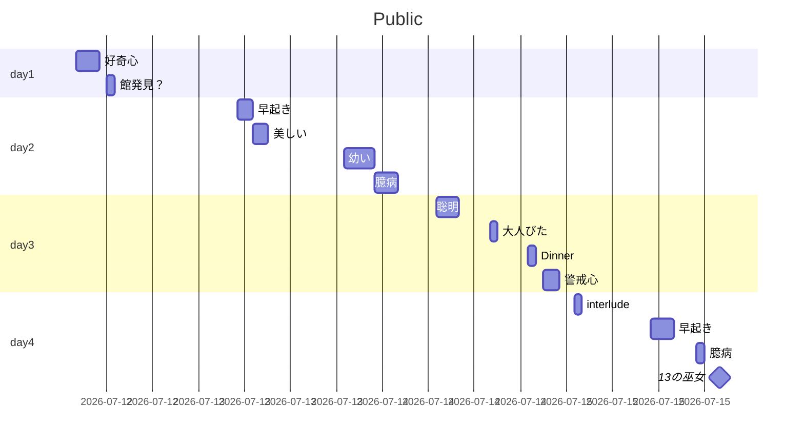
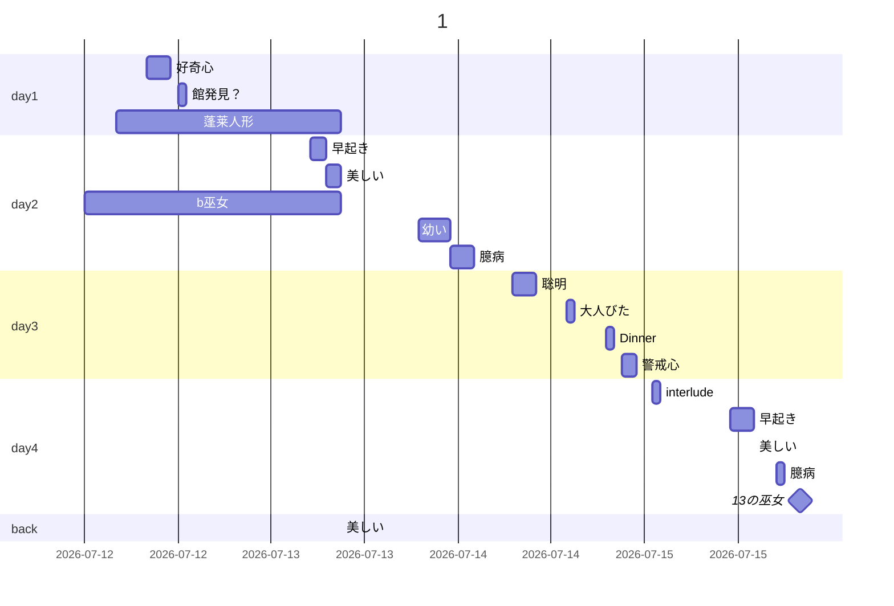

頒布日 2002-12-30
一日目
＃1、好奇心
館発見？
二日目
＃2、早起き、朝、雨
＃3、美しい、雨
＃4、幼い、夜のパーティ
不明
＃5、臆病
三日目
＃6、聡明、目覚める
＃7、状況説明
＃8、館説明
＃9、大人びた、午後
臆病の夕食？
＃10、警戒心、寝静まる
interlude、朝食の準備
四日目
＃11、早起き、今朝のハムエッグ
＃12、臆病、昨日の夕食後、昨夜を思い出せない
＃13、巫女、一日の終わりの日記

少なくとも警戒心を臆病以外が殺したとは考えにくい。警戒心だけ殺せなかったから臆病にやらせたとか。でも臆病な割に眉間に五寸釘って相当大胆な犯行だが。もしかして臆病だから逆に別の誰かにやらせたのか？
