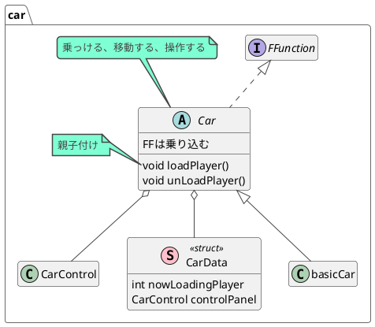

```plantuml-svg
@startuml
'https://plantuml.com/class-diagram
hide empty members
!theme vibrant

package car{
    abstract class Car implements FFunction{
      
        void loadPlayer()
        void unLoadPlayer()
        FFは乗り込む
    }
    note top of Car:乗っける、移動する、操作する
  
    note left of Car::loadPlayer
        親子付け
    endnote
  
    Car o-- CarControl
    Car o-- CarData
  
    class CarControl{
    }
  
    class CarData<<(S,pink)struct>> {
        int nowLoadingPlayer
        CarControl controlPanel
    }
  
    class basicCar extends Car{
      
    }
}

@enduml
```