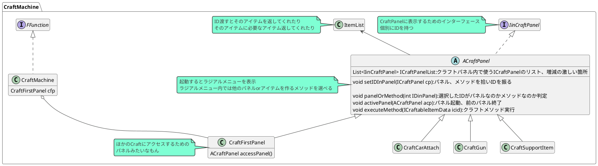

```plantuml-svg
@startuml
'https://plantuml.com/class-diagram
hide empty members
!theme vibrant

package CraftMachine{
    class CraftMachine implements FFunction{
        CraftFirstPanel cfp
      
    }

    CraftMachine o-- CraftFirstPanel

    class CraftFirstPanel extends ACraftPanel{
        ACraftPanel accessPanel()
    }

    note left of CraftFirstPanel
        ほかのCraftにアクセスするための
        パネルみたいなもん
    endnote

    interface IinCraftPanel{
    }

    note left of IinCraftPanel
        CraftPanelに表示するためのインターフェース
        個別にIDを持つ
    endnote

    abstract class ACraftPanel implements IinCraftPanel{
        /'
        abstract int const PanelID:コンストラクタでパネルごとに指定
        CraftMethodOrg cmo:コンストラクタでただ一つのOrgを指定
        void setMethod(CraftMethodOrg cmo,int panelID,params Func[] methodList):コンストラクタで全てのメソッドをOrgに登録
        bool craftNeedItemCheck():ここで記述
        abstract Item craftItem(Item[] i)
        '/
        List<IinCraftPanel> ICraftPanelList:クラフトパネル内で使うICraftPanelのリスト、増減の激しい箇所

        void setIDInPanel(ICraftPanel cp):パネル、メソッドを拾いIDを振る

        void panelOrMethod(int IDinPanel):選択したIDがパネルなのかメソッドなのか判定
        void activePanel(ACraftPanel acp):パネル起動、前のパネル終了
        void executeMethod(ICraftableItemData icid):クラフトメソッド実行
    }

    note left of ACraftPanel
        起動するとラジアルメニューを表示
        ラジアルメニュー内では他のパネルorアイテムを作るメソッドを選べる
    endnote

    ItemList <-- ACraftPanel

    note left of ItemList
        ID渡すとそのアイテムを返してくれたり
        そのアイテムに必要なアイテム返してくれたり
    endnote

    note left of ACraftPanel::craftItem
    内部を読み取って適切なアイテムを返す
    endnote

    class CraftGun extends ACraftPanel{
        /'Item Assault(Item)
        Item SMG(Item)
        Item Sniper(Item)
        Item Shotgun(Item)
        Item LMG(Item)
        '/
    }

    class CraftSupportItem extends ACraftPanel{
    /'
        Item Grappling(Item)
        Item Launcher(Item)
    '/
    }

    class CraftCarAttach extends ACraftPanel{
        /'Item Turret(Item)
    '/
    }
}

@enduml
```