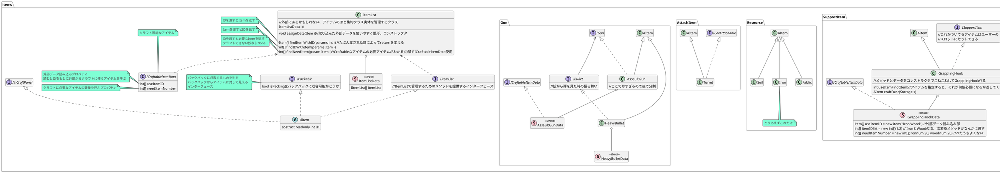

```plantuml-svg
@startuml
'https://plantuml.com/class-diagram
hide empty members
!theme vibrant


package items{
	class ItemList{
		//外部にあるかもしれない、アイテムのIDと集約クラス実体を管理するクラス
		ItemListData ild

		void assignData(Item i)//取り込んだ外部データを使いやすく整形、コンストラクタ

		Item[] findItemWithID(params int i) //たぶん渡された数によってreturnを変える
		int[] findIDWithItem(params Item i)
		int[] findNeedItem(param Item i)//Craftableなアイテムの必要アイテムがわかる,内部でICraftableItemData使用
	}

	note left of ItemList::findItemWithID{
		IDを渡すとItemを返す
	}

	note left of ItemList::findIDWithItem{
		Itemを渡すとIDを返す
	}

	note left of ItemList::findNeedItem{
		IDを渡すと必要なItemを返す
		クラフトできない奴ならNone
	}

	ItemList o-- ItemListData
	ItemList <.. ICraftableItemData

	class ItemListData<<(S,pink)struct>>{
		IItemList[] itemList
	}

	interface IPackable{
		bool isPacking():バックパックに収容可能かどうか
	}

	ItemList <.. IItemList

	interface IItemList{
		//ItemListで管理するためのメソッドを提供するインターフェース
	}

	note left of IPackable{
		バックパックに収容するものを判定
		バックパックからアイテムに対して見える
		インターフェース
	}

	abstract class AItem implements IPackable,IItemList, IinCraftPanel{
		abstract readonly int ID
	}

	interface ICraftableItemData{
		int[] useItemID
		int[] needItemNumber
	}

	note left of ICraftableItemData::useItemID{
		外部データ読み込みプロパティ
		読むとIDをもとに外部からクラフトに使うアイテムを呼ぶ
	}

	note left of ICraftableItemData::needItemNumber{
		クラフトに必要なアイテムの数量を呼ぶプロパティ
	}

	note top of ICraftableItemData{
		クラフト可能なアイテム
	}

	package SupportItem{
		interface ISupportItem{
			//これがついてるアイテムはユーザーの
			//スロットにセットできる
		}


		class GrapplingHook extends AItem implements ISupportItem{
			//メソッドとデータをコンストラクタでこねこねしてGrapplingHook作る
			int useItemFind(Item)//アイテムを指定すると、それが何個必要になるか返してくれる便利関数
			AItem craftFunc(Storage s)
		}

		GrapplingHook o-- GrapplingHookData

		class GrapplingHookData<<(S,pink)struct>> implements ICraftableItemData{
			item[] useItemID = new item("Iron,Wood") //外部データ読み込み部
			int[] itemIDlist = new int[](1,2) // IronとWoodのID、ID変換メソッドかなんかに通す
			int[] needItemNumber = new int[](ironnum:30, woodnum:20) //べたうちよくない
		}
	}


	package Resource{
		class Soil extends AItem{

		}

		class Iron extends AItem{

		}

		note bottom of Iron:とりあえずこれだけ

		class Fablic extends AItem{

		}
	}

	package AttachItem{
		interface ICarAttachable{
		}

		class Turret extends AItem implements ICarAttachable{
		}
	}

	package Gun{

		interface IBullet{
			//銃から弾を見た時の振る舞い
		}

		class HeavyBullet extends AItem implements IBullet{
		}

		HeavyBullet o-- HeavyBulletData

		class HeavyBulletData<<(S,pink)struct>>{
		}

		IGun <-- IBullet

		interface IGun{
		}

		class AssaultGun extends AItem implements IGun{
			//ここでかすぎるので後で分割
		}

		AssaultGun o-- AssaultGunData

		class AssaultGunData<<(S,pink)struct>> implements ICraftableItemData{
		}
	}
}

@enduml
```
