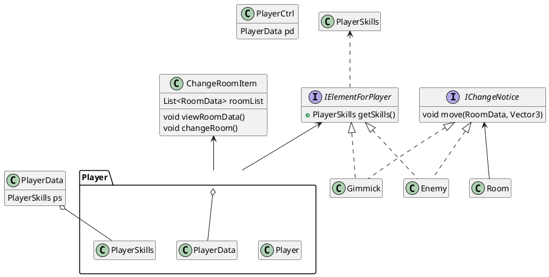

```plantuml
@startuml
hide empty members

package Player{
	class Player
	class PlayerData
	class PlayerSkills
}

class PlayerCtrl{
	
    PlayerData pd
}

Player o-- PlayerData

class PlayerData{
	PlayerSkills ps
}

PlayerData o-- PlayerSkills

class PlayerSkills{
	
}

PlayerSkills <.. IElementForPlayer


class ChangeRoomItem{
	List<RoomData> roomList

	void viewRoomData()
	void changeRoom()
}

ChangeRoomItem <-- Player


interface IElementForPlayer{
	+PlayerSkills getSkills()
}

IElementForPlayer <-- Player

interface IChangeNotice{
	void move(RoomData, Vector3)
}
IChangeNotice <-- Room


class Enemy implements IElementForPlayer, IChangeNotice{
	
}

class Gimmick implements IElementForPlayer, IChangeNotice{
	
}

@enduml
```
